xml
---
1. 转达信息
2. 报告添加内容

# 1. XML概述

## 1.1. XML 定义
1. Extensible Markup Language：A set of rules for encoding documents electronically
2. W3C于1998年推出的一种用于数据描述的元标记语言的国际标准

## 1.2. XML标准系列
1. 核心
   1. XML Information Set
   2. Document Type Declaration
   3. XML Schema
   4. Namespace
2. 展现与转换
   1. CSS
   2. XSL:eXtensible Stylesheet Language
3. 定位、链接与查询
   1. Xpath:XML Path Language
   2. Xpointer:XML Pointer Language
   3. Xlink:XML Linking Language
   4. Xquery:XML Query Language

## 1.3. XML版本
1. 1.0版--Extensible Markup Language (XML) 1.0
   1. 第一版:1998.2.10. W3C推荐标准
   2. 第二版:2000.10.6. W3C推荐标准（加删少量DTD生成式,修改错误,改进描述）
   3. 第三版:2004.2.4. W3C推荐标准（修改错误,改进描述）
   4. 第四版:2006.8.16. W3C推荐标准（修改错误,改进描述）
   5. 第五版:2008.11.26. W3C推荐标准（修改错误,放宽了对元素和属性命名字符的限制,~XML 1.1）
2. 1.1版--Extensible Markup Language (XML) 1.1（元素和属性名称所采用扩展字符集）
   1. 第一版:2004.2.4. W3C推荐标准
   2. 第二版:2006.8.16.（修改错误,改进描述）

## 1.4. 置标语言家谱表
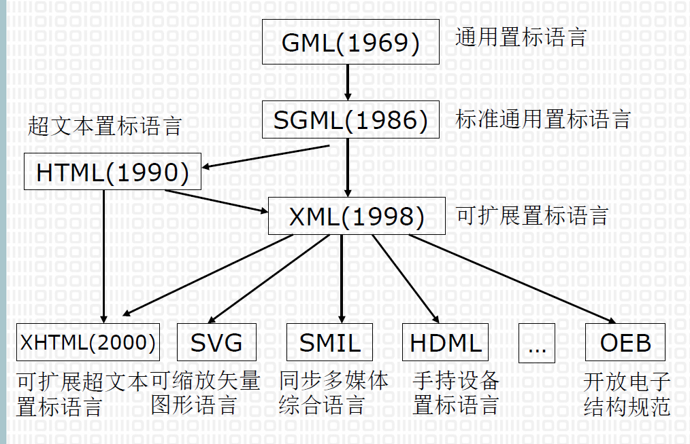

## 1.5. Web体系结构的发展
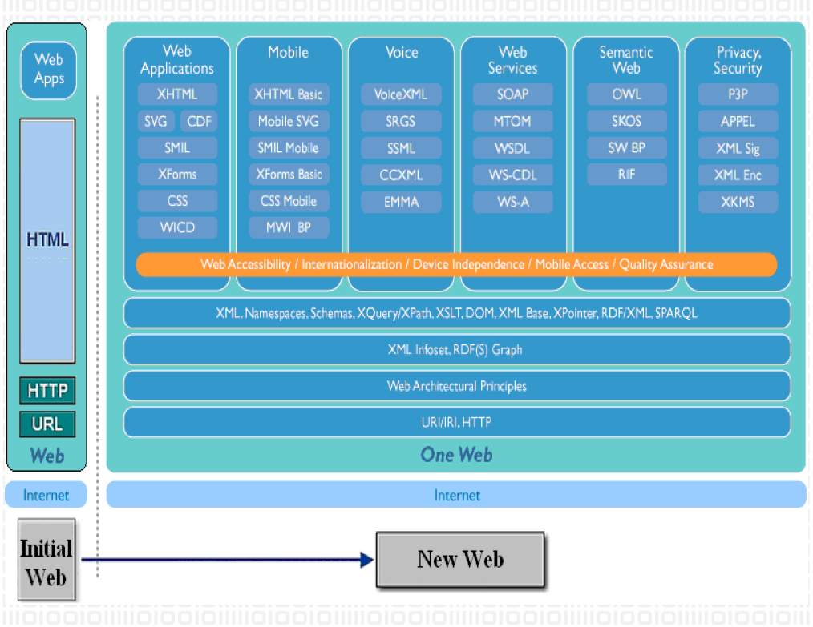

## 1.6. HTML和XHTML
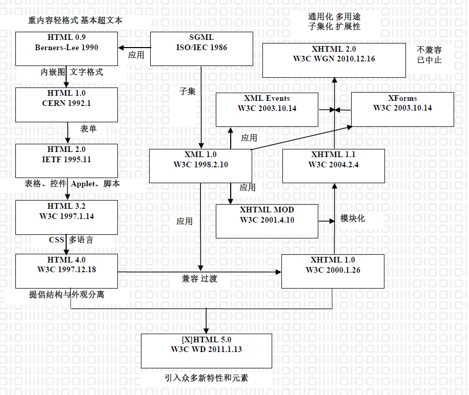

1. 标准的xml
```html
<UL>
  <LI>张三</LI>
  <UL>
    <LI>用户ID:001</LI>
    <LI>公司:A公司</LI>
    <LI>EMAIL:zhang＠aaa．com</LI>
    <LI>电话:(010)62345678</LI>
    <LI>地址:五街1234号</LI>
    <U>城市:北京市</LI>
    <LI>省份:北京</LI>
  </UL>
  <LI>李四</LI>
  <UL>
    <LI>用户ID:002</LI>
    <LI>公司:B公司</LI>
    <LI>EMAIL:li＠bbb．org</LI>
    <LI>电话:(021)87654321</LI>
    <LI>地址:南京路9876号</LI>
    <LI>城市:上海市</LI>
    <LI>省份:上海<LI>
  </UL>
</UL>
```

2. 具有语义的xml
```xml
<联系人列表>
  <联系人>
    <姓名>张三</姓名>
    <ID>001</ID>
    <公司>A公司</公司>
    <EMAIL>zhang@aaa.com</EMAIL>
    <电话>(010)62345678</电话>
    <地址>
      <街道>五街1234号</街道>
      <城市>北京市</城市>
      <省份>北京</省份>
    </地址>
  </联系人>
  <联系人>
    <姓名>李四</姓名>
    <ID>002</ID>
    <公司>B公司</公司>
    <EMAII>1i@bbb.org</EMAII>
    <电话>(021)87654321<电话>
    <地址>
      <街道>南京路9876号</街道>
      <城市>上海市</城市>
      <省份>上海</省份>
    </地址>
  </联系人>
</联系人列表>
```

## 1.7. XML和HTML比较
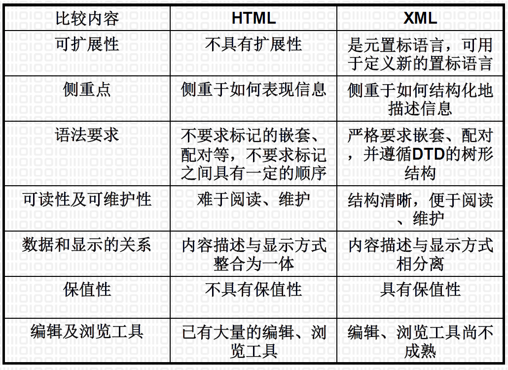

## 1.8. XML的特点
1. 自描述性
2. 内容独立性
3. 可扩展和复用性
4. 便于网络传输
   1. Java = Portable Programs
   2. XML = Portable Data


## 1.9. XML最重要的五个应用
1. 数据交换:XML使用元素和属性来描述数据。在数据传送过程中,XML始终保留了诸如父/子关系这样的数据结构
2. Web服务:SOAP可以在用不同编程语言构造的对象之间传递消息
3. 内容管理:XML只用元素和属性来描述数据,而不提供数据的显示方法。XSLT等能够轻易地将XML文件转换成各种格式文件,比如HTML, WML, PDF, flat file, EDI等
4. Web集成:在个人电子助理和浏览器之间用XML来传递数据
5. 配置:将配置数据标记为XML格式,能使其更具可读性,并能方便地集成到应用系统中去；.NET中的XmlDocument和XmlTextReader

## 1.10. XML设计目标
1. 在互联网上直接使用
2. 支持各种各样的应用程序
3. 与SGML兼容
4. 应用程序应该容易编写
5. 可选特性的数量应该减到最小,最好减至没有
6. 良好的可读性,并且比较清晰
7. 用XML设计新的标记语言方便快捷
8. XML设计的标记语言正式、简洁
9. XML文件容易创建
10. XML标记的简洁性无关紧要

## 1.11. 开发XML应用的步骤
1. 考察应用场景,确定是否使用XML
2. 设计系统架构和工作流程
3. 设计XML文档中使用的标签（语汇集）
4. 根据语汇集开发处理XML文档的应用程序
5. 特定场景下（如网站发布）还需要编写XSLT文档以转换XML文档生成目标数据

## 1.12. XML的缺点
1. 结构不够紧凑:传统的二进制文档
2. 性能较低
   1. 额外的文档分析过程
   2. 更多的存储空间
   3. 读写XML文档需要执行更多的输入输出操作
   4. 缺少索引机制,大量数据读取和更新的效率比数据库操作低很多

## 1.13. XML应用实例
1. 为置标语言FCLML公司的客户列表置表语言制定的,文档类型定义DTD,其程序为fclml.dtd
2. 客户联系信息的XML文档Client.xml
3. 为client.xml制定一个样式Mystyle.xsl
4. Html格式及显示

### 1.13.1. Fclml.dtd
```xml
<? xml version="1.0" encoding="GB2312"? >
<!ELEMENT 联系人列表(联系人)*>
<!ELEMENT 联系人(姓名,ID,公司,EMAIL,电话,地址)>
<!ELEMENT 地址(街道,城市,省份)>
<!ELEMENT 姓名(#PCDATA)>
<!ELEMENT ID(#PCDATA)>
<!ELEMENT 公司(#PCDATA)>
<!ELEMENT EMAIL(#PCDATA)>
<!ELEMENT 电话(#PCDATA)>
<!ELEMENT 街道(#PCDATA)>
<!ELEMENT 城市(#PCDATA)>
<!ELEMENT 省份(#PCDATA)
```

### 1.13.2. Client.xml
```xml
<? xml version="1.0"encoding="GB2312" standalone="no"?>
<!DOCTYPE 联系人列表 SYSTEM" fclml．dtd">
<?xml-stylesheettype="text/xsl" href="mystyle．xsl"?>

<联系人列表>
  <联系人>
    <姓名>张三</姓名>
    <ID>001</ID>
    <公司>A公司</公司>
    <EMAIL>zhang@aaa.com</EMAIL>
    <电话>(010)62345678</电话>
    <地址>
      <街道>五街1234号</街道>
      <城市>北京市</城市>
      <省份>北京</省份>
    </地址>
  </联系人>
  <联系人>
    <姓名>李四</姓名>
    <ID>002</ID>
    <公司>B公司</公司>
    <EMAII>1i@bbb.org</EMAII>
    <电话>(021)87654321<电话>
    <地址>
      <街道>南京路9876号</街道>
      <城市>上海市</城市>
      <省份>上海</省份>
    </地址>
  </联系人>
</联系人列表>
```

### 1.13.3. MyStyle.xsl
```xsl
<?xml version="1．0"encoding="GB2312"?>
<xsl:stylesheetxmlns:xsl="http://www.w3.org/TR/WD-xsl"
xmlHs="http://www.w3.org/TR/REC-html40" result-ns:="">
<xst:template><xsI:apply-templates/></xsl:template>
<xsl:template match="/">
  <HTML>
  <HEAD>
    <TITLE>F公司的客户联系信息</TITlE>
  </HEAD>
  <BODY>
    <xsl:apply-templates select="联系人列表"/>
  </BODY>
  </HTML>
</xsl:template>
```

### 1.13.4. Html格式
```xsl
<xsl:stemplat match="联系人列表">
  <xsl:for-each select="联系人">
    <UL>
    <LI><xsl:value-of select="姓名"/><LI>
    <UL>
      <LI>用户ID:<xsl:value-of select="ID"/></LI>
      <LI>公司:<xsl:value-of select="公司"/></LI>
      <LI>EMAIL:<xsl:value-of select="EMAIL"/></LI>
      <LI>电话:<xsl:value-of select="电话"/></LI>
      <LI>街道:<xsl:value-of select="地址/街道"/></LI>
      <LI>城市:<xsl:value-of select="地址/城市"/></LI>
      <LI>省份:<xsl:value-of select="地址/省份"/></LI>
    </UL>
    </UL>
  </xsl:for-each>
  </xsl:template>
</xsl:stylesheet>
```

### 1.13.5. XML格式
```xml
<HTML>
  <HEAD>
    <TITLE>F公司的客户联系信息</TITLE>
  </HEAD>
  <BODY>
    <UL>
    <LI>张三</LI>
    <UI>
      <LI>用户ID：001</LI>
      <LI>公司：A公司</LI>
      <LI>EMAIL:zhang＠aaa．com</LI>
      <LI>电话：(010)62345678</LI>
      <LI>地址：五街1234号</LI>
      <LI>城市：北京市</LI>
      <LI>省份：北京</LI>
    </UL>
    <LI>李四</LI>
    <UL>
      <LI>ID：002</LI>
      <LI>公司：B公司</LI>
      <LI>EMAIL：1i＠bbb．or8</LI>
      <LI>电话：(021)87654321</LI>
      <LI>地址：南京路9876号</LI>
      <LI>城市：上海市</LI>
      <LI>省份：上海</LI>
    </UL>
    </UL>
  </BODY>
</HTML>
```

### 1.13.6. 显示


# 2. XML语法
```xml
<?xmlversion="1．0"encoding="GB2312"standalone="no"?>
<?xml—stylesheettype="text/xsl"href="mystyle．xsl"?>
<专有名词列表>
  <专有名词>
    <名词>XML</名词>
    <解释>XMI是一种可扩展的元置标语言,它可用以规定新的置标规则,并根据这个规则组织数据</解释>
    <示例>
    <!-一个XML的例子->
    <![CDATA[
    <联系人>
    <姓名>张三</姓名>
    <EMAIL>zhang＠aaa．com</EMAIL>
    </联系人>
    ]]>
    </示例>
  </专有名词>
</专有名词列表>
```

## 2.1. XMl文档的基本构成
1. XMl声明
2. 处理指令(可选)
3. XML元素
   1. [1]是XML声明
   2. [2]是处理指令
   3. [3]一[17]是文档中的各个元素
   4. [8]是注释
   5. [9]～[14]是CDATA节
   6. 在[5]行的`<名词>XML</名词>`中,`<名词>``</名词>`是标记,"XML"是字符数据

## 2.2. XML整体逻辑结构总结
1. XML文档通常以一个XML声明开始
2. 通过XML元素来组织XML数据
3. XML元素包括标记和字符数据
4. 为组织数据更方便、清晰,在字符数据中引入CDATA数据块
5. 在文档中引入注释
6. 需要给XML处理程序提供一些指示信息,XML文档中可以包含处理指令

## 2.3. XML语法概述
1. 元素规则
2. 必须有结束标记
3. 属性取值要加引号
4. 实体引用
5. 注释的语法
6. 空格会被保留

### 2.3.1. 元素规则
1. 名字中不能包含空格
2. 名字不能以数字或标点符号开头
3. 名字不能以任何大小写的xml开头
4. 左尖括号（<）后不可以有空格
5. 起始和结束标签的大小写必须一致
6. XML文件中出现的第一个元素是根元素
7. 根元素必须有完整的起始和结束标签
8. 所有的子元素必须嵌套在一个根元素中

```xml
<Root>
  <ChildA>
    <ChildB>content
    </ChildB>
  </ChildA>
</Root>
```

9.  嵌套元素不可以相互重叠
10. 子元素如果内容为空
11. 可以缩写标签:`<ElementName />`

#### 2.3.1.1. 根元素
1. XML 文档必须包含在一个单一元素中。

```xml
<?xml version="1.0"?>
<!--A well-formed document -->
<greeting>
  Hello, World!
</greeting>
```
2. 不包含单一根元素的文档都会被XML 解析器拒绝

### 2.3.2. 必需有结束标记
1. 不能省去任何结束标记
2. 如果一个元素根本不包含标记,则称为空元素；HTML 换行（`<br>`）和图像（``）元素就是两个例子。在XML文档的空元素中,可以把结束斜杠放在开始标记中。下面的两个换行元素和两个图像元素对于XML 解析器来说是一回事：
```xml
</img>

```

### 2.3.3. 属性
1. 名称不够用
2. 命名规则和元素的命名规则类似
3. 属性必须有值
4. 属性值必须用单引号或双引号括起,且要始终保持一致

### 2.3.4. 实体引用
1. 一些字符拥有特殊的意义

```xml
<message>if salary < 1000 then</message>
<message>if salary &lt; 1000 then</message>
```

2. 5个预定义的实体引用
   1. `&lt;` < 小于
   2. `&gt;` > 大于
   3. `&amp` & 和号
   4. `&apos` ' 单引号
   5. `&quot;` " 引号

### 2.3.5. CDATA字节
1. 元素内容的字符数据中不能插入左尖括号"<"或连字符"&"
2. 数据难以阅读
3. `<![CDATA[…]]>`
4. 不包含字符串"]]>"即可

### 2.3.6. 注释
```xml
<!--This is a comment -->
```
1. 空格会被保留
   1. HTML 会把多个连续的空格字符裁减为一个
   2. 在XML 中,文档中的空格不会被删节
2. 双连字符"--"不能在注释中出现
3. 注释不能以"--->"终止

### 2.3.7. 良好格式（Well-formed）
1. XML文件的第一行必须是声明该文件是XML文件以及它所使用的XML规范版本
2. 在XML文件中有且只能够有一个根元素
3. 在XML文件中的标记必须正确地关闭
4. **标记之间不得交叉**
5. 属性值必须要用引号括起来
6. 控制标记、指令和属性名称等英文要区分大小写

### 2.3.8. XML名称空间
1. 不同领域的XML语汇的识别问题
2. 类似属性的形式声明
   1. xmlns: URI
   2. xmlns:xx(前缀) = 某URI
   3. URI代表名称空间所属的领域
3. 名称空间的作用范围：名称空间的作用范围就是该元素以及该元素所包含的元素和属性

# 3. DTD与Scheme

## 3.1. DTD(Document Type Definition)
1. 一套关于标记符的语法规则,XML1.0版标准中XML文件的验证机制,属于XML文件组成的一部分
2. 一种保证XML文档格式正确的有效方法,可以通过比较XML文档和DTD文件来看文档是否符合规范,元素和标签使用是否正确
3. 想使用XML进行数据交换的行业或组织可定义自己的DTD
4. DTD文件是ASCII文本文件,后缀名为.dtd

### 3.1.1. 内部DTD示例
```xml
<?xml version="1．0"encoding="GB2312",standalone="yes">
<!DOCTYPE联系人列表[
<!ELEMENT 联系人列表(联系人)*>
<!ELEMENT 联系人(姓名,ID,公司,EMAIL,电话)>
<!ELEMENT 姓名(#PCDATA)>
<!ELEMENT ID(#PCDATA)>
<!ELEMENT 公司(#PCDATA)>
<!ELEMENT EMAIL(#PCDATA)>
<!ELEMENT 电话(#PCDATA)>
]>
<联系人列表>
  <联系人>
    <姓名>张三</姓名>
    <ID>001</ID>
    <公司>A公司</公司>
    <EMAIL>zhang＠aaa．com</EMAIL>
    <电话>(010)62345678</电话>
  </联系人>
</联系人列表>
```

### 3.1.2. 外部DTD
```xml
<? xml version="1.0" encoding="GB2312"? >
<!ELEMENT 联系人列表(联系人)*>
<!ELEMENT 联系人(姓名,ID,公司,EMAIL,电话,地址)>
<!ELEMENT 地址(街道,城市,省份)>
<!ELEMENT 姓名(#PCDATA)>
<!ELEMENT ID(#PCDATA)>
<!ELEMENT 公司(#PCDATA)>
<!ELEMENT EMAIL(#PCDATA)>
<!ELEMENT 电话(#PCDATA)>
<!ELEMENT 街道(#PCDATA)>
<!ELEMENT 城市(#PCDATA)>
<!ELEMENT 省份(#PCDATA)>
```

### 3.1.3. 元素声明
1. `<!ELEMENT 元素名称元素的内容格式的定义>`
2. 基本元素声明：`<!ELEMENT 姓名(#PCDATA)>`
3. 复合元素声明：`<!ELEMENT 联系人(姓名,ID,公司,EMAIL,电话)>`

### 3.1.4. 元素出现次数的控制


### 3.1.5. 元素属性声明
```xml
<!ATTLIST 元素名 属性名 属性 类型 #REQUIRED>
<!ATTLIST 页面作者 姓名 CDATA #REQUIRED
#IMPLIED, #FIXED "缺省值">

```
1. 元素名是属性所属的元素的名字
2. 属性名是属性的名字
3. 缺省值是属性的初值
4. 属性类型用来指定其属于哪种有效属性

### 3.1.6. XML属性类型
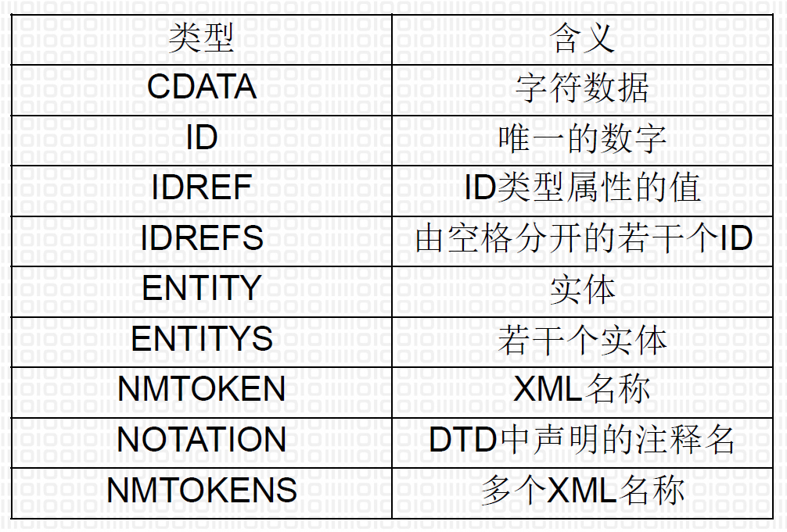

### 3.1.7. DTD的特点
1. DTD的优势在于每一个XML文档都可携带一个DTD，用来对该文档格式进行描述
2. 多个XML文档就都可以共享使用该DTD，使得数据交换更为有效。可以用某个DTD来检测接收到的数据是否符合某个标准
3. DTD比Schema更加精炼，文档篇幅相同的情况下能表示更多内容
4. DTD的局限性
   1. DTD不遵守XML语法
   2. DTD数据类型有限
   3. DTD不可扩展
   4. DTD不支持命名空间

## 3.2. Schema
1. 2001年5月2日成为W3C标准
2. XML文档结构和内容约束的机制
3. 获得W3C推荐标准的第一个独立的XML模式语言
4. XML的一种应用，将XML DTD重新按照XML语言规范来定义，充分体现了XML自描述性的特点

```xml
1.<?xml version="1.0" encording="GB2312"?>
2.
3. <学生花名册 年级="六年级" 班级="一班">
4.    <学生>
5.      <姓名>李华</姓名>
6.      <籍贯>河北</籍贯>
7.      <年龄>14</年龄>
8.      <电话>62875555 </电话>
9.    </学生>
10.   <学生>
11.     <姓名>王珊</姓名>
12.     <籍贯>北京</籍贯>
13.     <年龄>12</年龄>
14.     <电话>82618888</电话>
15.   </学生>
16. </学生花名册>
```

- 相应DTD描述

```xml
<!DOCTYPE 学生花名册[
<!ELEMENT 学生花名册（学生*）>
<!ATTLIST 学生花名册 年级CDATA # REQUIRED
                    班级CDATA # IMPLIED>
<!ELEMENT 学生(姓名+，籍贯，年龄，电话?)>
<!ELEMENT 姓名（# PCDATA）>
<!ELEMENT 籍贯(# PCDATA）>
<!ELEMENT 年龄(# PCDATA）>
<!ELEMENT 电话(# PCDATA）>
]>
```

- 上述第2行可用下面语句替换：`<!DOCTYPE 学生花名册SYSTEM "roster.dtd">`
- XML文档的结构：
  - 根元素"学生花名册"
    - "年级"
    - "班级"
  - "学生花名册"元素
    - "学生"元素
      - "姓名"
      - "籍贯"
      - "年龄"
      - "电话"
- 用XML Schema 来描述：rosterschema.xml

```xml
1.  <?xml version="1.0" encording="GB2312"?>
2.  <Schema
      xmlns="urn:schemas-microsoft-com:xml-data" xmlns:dt="urn:schemas-microsoft-com:datatypes">
3.    <AttributeTypename="年级"/>
4.    <AttributeTypename="班级"/>
5.    <ElementTypename="姓名"/>
6.    <ElementTypename="籍贯"/>
7.    <ElementTypename="年龄"/>
8.    <ElementTypename="电话"dt:type="fixed.14.4"/>
9.    <ElementTypename="学生" content="eltOnly">
10.     <elementTypename="姓名"/>
11.     <elementTypename="籍贯"/>
12.     <elementTypename="年龄"/>
13.     <elementTypename="电话"/>
14.   <ElementType>
15.   <ElementTypename="学生花名册" content="eltOnly">
16.     <elementType="学生"/>
17.     <attribute type="年级"/>
18.     <attribute type="班级"/>
19.   </ElementType>
20. </Schema>
```

- 为了给roster.xml指定文档定义规则，roster.xml第2行可用下面语句替换：`<学生花名册xmlns="x-schema:rosterschema.xml">`
- rosterschema.xml分析
  - 第1行是XML类型声明语句，指明该文档是一个XML文档，并且符合版本1.0规范；该文档采用GB2312编码
  - 第2行是Schema声明语句,它包含了Schema命名空间的声明
  - 本例中用到了两个命名空间
    - `xmlns="urn:schemas-microsoft-com:xml-data"`，指定本文档是一个XMLSchema文档
    - `xmlns:dt="urn:schemas-microsoft-com:datatypes">`，定义了本文档中可以使用的数据类型
  - 第3、4行是属性定义语句，它定义了两个属性：年级和班级
  - 第5-8行是元素定义语句，它定义了4个元素
  - 第9-14行定义了本XML Schema的二级元素：学生，指明该元素含有包含四个子元素：姓名、年龄、籍贯、电话
  - 第15-19行定义了本XML Schema的顶级元素：学生花名册，指明该元素包含一个子元素：学生，以及两个属性：年级、班级
  - 第20行是结束标记语句，它指明该XML Schema 的描述到此为止

### 3.2.1. Schema的优点
1. XML Schema支持数据类型
2. XML Schema使用XML语法
3. XML Schema安全数据通讯
4. XML Schema是可扩展的

#### 3.2.1.1. XML Schema支持数据类型
1. 更易于描述允许使用的文档内容
2. 更易于检验数据的有效性
3. 更易于与数据库中的数据一起协同工作
4. 更易于定义关于数据的限制
5. 更易于定义数据格式
6. 更易于将数据在不同的数据类型之间进行转换

#### 3.2.1.2. XML Schema使用XML语法
1. 可以不需要再学习一种全新的语言
2. 可以使用XML编辑器来编辑Schema文件
3. 可以使用XML解析器解析Schema文件
4. 可以使用XML DOM 处理Schema
5. 可以使用XSLT转换Schema

#### 3.2.1.3. XML Schema安全数据通讯
1. 当数据由发送者传递给接受者，数据内容理解的一致性。基于XML Schema，发送者可以用接受者能够理解的方式描述数据
2. 日期"03-11-2004"的理解

```xml
<date type="date">
2004-03-11
</date>
```

#### 3.2.1.4. XML Schema是可扩展的
1. 因为XML Schema文件是由XML编写，所以可扩展
2. 在其它的Schema文件中再次再次使用你的Schema
3. 从标准的数据类型中派生出你自己的数据类型
4. 在同一个文档中参考多种Schema

### 3.2.2. Schema 声明
1. XML Schema的根元素为schema 元素：位于XML Schema的名字空间xs(XML Schema)或xsd(XML Schema definition)中
2. Schema元素含有多个属性
   1. 名字空间声明（必须）
   2. 其他在本文档中要用到的名字空间的声明（可选）
   3. 该文档描述的目标名字空间（可选）
   4. 语言（可选）等
3. 常用格式为：

```xml
<xsd:schema xmlns:xsd= "http://www.w3.org/2001/XMLSchema"
  xmlns[:名字空间名] = "URI" <!--可有若干个-->
  targetNamespace= "URI"
  xml:language= "语种">
    若干子元素
</xsd:schema>
```

### 3.2.3. 元素的声明
```xml
<elementType name="元素名"
  content ="{empty|textonly|eltonly|mixed}"
  dt:type= "类型参数"
  order = "{one|seq|many}"
  model = "{open|close}"
  minOccurs="最少出现次数"
  maxOccurs="最大出现次数">
</elementType>
```
1. 最简单的声明：`<elementType name="A" content= "empty"/>`

### 3.2.4. 属性声明
```xml
<AttributeType
  name = "属性名"
  dt:type= "属性类型"
  dt:value= "枚举值列表"
    default = "默认值"
  required = "{yes|no}" />
```

1. 例子
```xml
<Xsd: element name = "DNASample">
  <xsd: complexType>
  <xsd: sequence>
  <xsd: element name = "sample" type = "dnaType" minOccurs= "2" maxOccurs= "5" />
  </xsd: sequence>
  </xsd: complexType>
  </Xsd: element>
```

2. 不合法

```xml
<DNASample>
  <sample>GATCTATC</sample>
</DNASample>
```

### 3.2.5. 类型定义
1. 内置数据类型：数字、串、时间等预定义的基本数据类型，用于叶元素内容和属性值，还可用作简单类型的基
2. 简单类型：对内置数据类型的约束、列表和联合，自定义数据的结构和范围，也用于叶元素内容和属性值
3. 复杂类型：定义元素的子元素和属性，确定文档的逻辑结构，只能用于根元素和中间元素

#### 3.2.5.1. Scheme XML 的两种类型
1. 简单类型：
   1. 没有属性和子元素用来定义其他类型
   2. 包含40种以上的预定义的简单类型
2. 复杂类型：
   1. 可以存在多个属性
   2. 可以用在其他复杂类型的定义中
   3. 不能用来定义简单类型
   4. 可以有子元素
3. 内置基本类型
   1. 数字：decimal（十进制数）、float（浮点数）、double（双精度数）、hexBinary（十六进制数）、base64Binary（基64数）
   2. 时间：duration（期间）、dateTime（日期与时间）、time（时间）、date（日期）、gYearMonth（年月）、gYear（年）、gMonth（月）、gMonthDay（月日）、gDay（日）
   3. 其他：string（串）、boolean（布尔）、anyURI（任意统一资源标识符）、QName（限定名qualified name）、NOTATION（符号）

### 3.2.6. 有效性验证
1. 解析器构造XML文档，判断文档是否格式良好
2. 验证文档信息项(例如一个元素)
   1. 根据元素的名域URI ，获取Schema
   2. 将文档信息项关连到相应Schema Component（如元素声明）
   3. 判断Schema Component是否有效
   4. 判断Information Item是否符合Schema Component
3. 重复第二步，直到验证完整个文档

```xml
[01]  <?xml version="1.0"?>
[02]  <students xmlns:stud="http://cscw.buaa.edu.cn/Schema-Stud"
      class="SY9061">
[03]    <student SId="12345">
[04]      <name>Lin</name>
[05]      <age>20</age>
[06]    </student>
[07]    <student sId="345657">
[08]      <name>Li</name>
[09]    </student>
[10]  </students>
```

```xml
[01]<xsd:schema xmlns:xsd=http://www.w3.org/2000/08/XMLSchema
[02]    targetNamespace="http://cscw.buaa.edu.cn/Schema-Stud">
[08]  <xsd:elementname="students" type="StudentsType"/>
[09]  <xsd:complexTypename="StudentsType">
[10]    <xsd:sequence>
[11]      <xsd:elementname="student" type="StudentType" maxOccus="unbounded"/>
[12]    </xsd:sequence>
[13]    <xsd:attributename="class" type="xsd:NMTOKEN"/>
[14]  </xsd:complexType>
[15]  <xsd:complexTypename="StudentType">
[16]    <xsd:sequence>
[17]      <xsd:elementname="name" type="xsd:string"/>
[18]      <xsd:elementname="age" type="xsd:int" minOccus="0"/>
[19]    </xsd:sequence>
[20]    <xsd:attributename="sId" type="xsd:NMTOKEN"/>
[21]  </xsd:complexType>
[22]</xsd:schema>
```

# 4. XSL,XSLT 和 XPath

## 4.1. XSL
1. eXtensibleStylesheetLanguage，即可扩展样式表语言，w3c 推荐的一种标准，用以定义XML 文档的转换与格式化
2. 包含三个部分
   1. XSLT（XSL Transformations）用于转换XML 文档的语言
   2. XPath(XML Path Language) 用于在XML 文档中导航的语言
   3. XSL-FO（XSL Formatting Objects）一种用于格式化XML 文档的语言

### 4.1.1. Why need XSL
1. XML文档开发时会遇到的问题
   1. 面向一个应用设计的组织数据的结构可能对另外的应用不适应
   2. 需要根据用户不同而对源文件处理，使之呈现内容不同，或者隐藏掉一些内容
   3. 开发者选择的结构可能其他人员不熟悉，或者不习惯
2. 相同数据在不同终端显示，设备不同，显示要求也不一样，XSLT使得避免了大量繁琐的工作
3. CSS是一种静态的样式描述格式，其本身不遵从XML的语法规范

### 4.1.2. XSLT文件的格式
1. 宣告部分

```xml
<?xml version="1.0"?>
<xsl:stylesheetversion ="1.0" xmlns:xsl="http://www.w3.org/1999/XSL/Transform">
```

2. 主程式部分
3. 函数部分

### 4.1.3. XSLT的主程式
1. 主程式必须由`<xsl:template match="/">`标签开始，而以`</xsl:template>s`结束
2. XSL 程式开始执行时，先执行主程式，其他函数的执行是透过主程式或别的函数来调用
3. XSL 程式的输出是HTML 、XML或其他结构化的文件

### 4.1.4. XSLT程式的函数
1. 函数由`<xsl:template>`标签开始，以`</xsl:template>`结束
2. 和主程式的写法类似，只是函数名称不同。主程式的名称是match="/" 中的"/" ，表示原来XML 文件的根标签
3. 函数名称定义在<xsl:template match="函数名称" > 标签中match 的attribute 值，即"函数名称" ，此函数名称是原来XML 文件中的标签名称

### 4.1.5. match="具体匹配表达式"
1. 从XML文档中取出一个特定的节点集合

```xml
<xsl:templatematch="/">
<xsl:templatematch="shoppingcart/item">
<xsl:templatematch="/shoppingcart/item">
<xsl:template match="shoppingcart/item[@itemNo='3333']">
```

```xml
<shoppingcart>
  <item>
    <itemNo>3333</itemNo>
    <itemName>屠龙刀</itemName>
  </item>
  <item>
    <itemNo>4444</itemNo>
    <itemName>离别钩</itemName>
  </item>
</shoppingcart>
```

### 4.1.6. xsl:for-each select="词语"
1. 列举特定的元素出来一一进行处理
2. order-by="+名称"
   1. "+"表示按降序排列；"-"表示按升序排列

```xml
<xsl:iftest=".[名称='..']">
<xsl:value-of select="元素名称/@属性名称"/>
<!-- 取属性值 -->
```

## 4.2. XPath
1. w3c颁布成为正式标准
   1. XSL和XPointer对XML源文档进行匹配以定位文档或文档部分时,XPath提供了一套整合的定位语法，能够向前或向后对文档片段进行定位
   2. XQuery中，也有广泛的应用
2. XML源文档经常被看作是一些节点的集合，称作源文档树
   1. XPath的表达式描述了一条对特定节点或节点集合的路径
   2. 使用符号斜线"/"来分离路径上的节点

### 4.2.1. XML文档树节点类型
1. 根节点
2. 元素节点
3. 文本节点
4. 属性节点
5. 名字空间节点
6. 处理指令节点
7. 注释节点

### 4.2.2. XPath表达式
1. XPath的核心语法构架是表达式，XPath表达式由一系列的步组成，从根节点开始，步步深入，层层分析，直到最后一步返回结果
   1. 数字类型
   2. 布尔类型
   3. 字符串类型
   4. 节点集合

### 4.2.3. 当前上下文
1. context node：XPath定位步中的活跃元素
2. Root/…/Ancestor/Parent/SELF/Child/Descendant

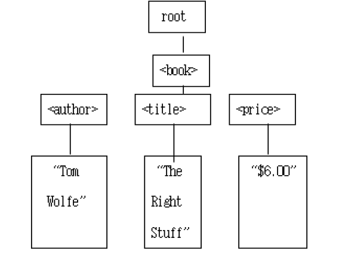

### 4.2.4. 定位路径组成
1. XPath定位路径是由一步或许多步构成，这些步被前斜线"/"分隔每一步都由三个部分组成
   1. …/axis::nodetest[predicate]/…
   2. 轴（axis）：由步选择的节点和当前上下文节点之间的关系
   3. 节点测试(nodetest)：由步选择的节点类型和节点扩展名称
   4. 谓词(predicate)：可以没有，由表达式进一步筛选节点测试选择的节点集

### 4.2.5. 定位路径的种类
1. 绝对路径
   1. 从根节点开始搜索，并且表达式以："/"开头
   2. 例如：/child::catalog/child::tools
2. 相对路径：
   1. 基于当前上下文节点开始搜索
   2. 例如：child::tools/child::saw

### 4.2.6. 例子
1. `/paper/chapter[1]/section[2]/title`: 第一章第二部分的标题
2. `/paper/chapter/title`: 所有章的标题
3. `/paper/*/title`: 论文中任何子元素的标题
4. `parent::node()or..`: 当前节点的父节点
5. `self::node()or.`：当前节点
6. `../..`：当前节点的父节点的父节点
7. `child::*`：当前节点的子节点
8. `./following-sibling::node()/@status`：后继兄弟节点status属性

### 4.2.7. 轴
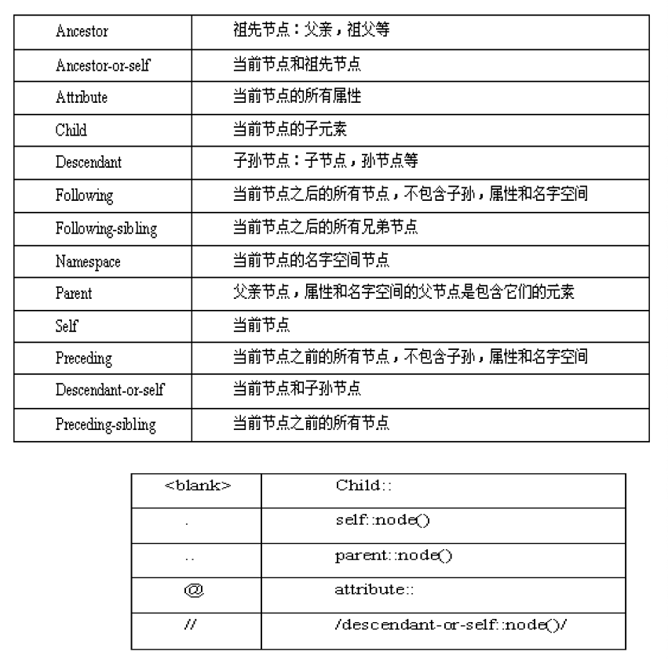

### 4.2.8. 节点测试
1. *对任何主节点类型的节点测试结果都为真
2. 形式为NCName:* 时，其前缀和限制名称一样利用当前基准的名域声明进行扩展，除了加入名域的限制外，其选择节点和 * 一样
3. 还可以选择节点的类型
   1. //Comment()：提取文档中所有的注释
   2. /book/chapter[2]//text():提取第二章中所有元素的实际文本内容；

### 4.2.9. 谓词
1. 轴和节点测试得到初始节点，由谓词进一步过滤，谓词形式为在方括号中加入谓词表达式，表达式为真时，选择该节点，否则不选择，谓词表达式经计算后结果是数字和非数字两种，若为数字，而且结果和该元素在初始节点集中的位置一样，表达式为真，否则为假

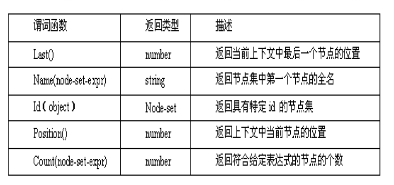

### 4.2.10. XPath中的字符串函数
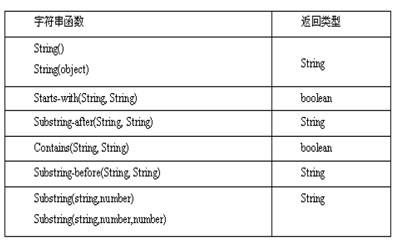

### 4.2.11. XPath中的数值函数
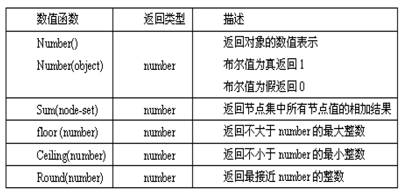

### 4.2.12. XPath中的布尔函数


### 4.2.13. 示例
```xml
<?xml version="1.0" encoding="ISO-8859-1"?>
<bookstore>
  <book>
    <title lang="eng">Harry Potter</title>
    <price>29.99</price>
  </book>
  <book>
    <title lang="eng">Learning XML</title>
    <price>39.95</price>
  </book>
</bookstore>
```

1. /bookstore/book[1]选取属于bookstore 子元素的第一个book 元素。
2. /bookstore/book[last()] 选取属于bookstore 子元素的最后一个book 元素。
3. /bookstore/book[last()-1] 选取属于bookstore 子元素的倒数第二个book 元素。
4. /bookstore/book[position()<3]选取最前面的两个属于bookstore 元素的子元素的book 元素。
5. //title[@lang]选取所有拥有名为lang的属性的title 元素。
6. //title[@lang='eng']选取所有title 元素，且这些元素拥有值为eng 的lang属性。
7. /bookstore/book[price>35.00]选取所有bookstore 元素的book 元素，且其中的price 元素的值须大于35.00。
8. /bookstore/book[price>35.00]/title 选取所有bookstore 元素中book 元素的title 元素，其中的price 元素的值须大于35.00

# 5. XML解析

## 5.1. XML解析技术的分类
1. 把代表XML文档的一个无结构的字符序列转换为满足XML语法的结构化组件的过程
   1. 面向文档的流式解析
   2. 面向文档的对象式解析
   3. 面向文档的指针式解析
   4. 面向应用的对象式解析

## 5.2. 面向文档的流式解析
1. 一种基于事件的解析过程，解析器顺序读取XML文档，产生一个对应的事件流，并向事件处理程序发送所捕获的各种事件，如元素开始和元素结束等
2. 能够立即读取数据，而不是等待所有的数据被处理
3. 不需要将整个文档一次加载到内存，效率较高
4. 易用性的降低，流式解析编程较为复杂
5. 单遍解析特性，不支持随机访问
6. 推式解析(SAX)和拉式解析(StAX)

## 5.3. 推式解析(SAX)
1. 解析器控制着读循环，在文档结束之前控制权不会返回给应用程序。解析器通过回调的方式进行数据处理
2. SAX基于事件驱动，SAX解析器在读取XML文档的过程中生成一个事件流，并且对于每个事件通过回调事件处理程序中相应的方法来进行处理。比如元素开始和结束标记，元素内容，实体，语法分析错误等事件。针对下面的简单XML文档，所产生的事件如图所示，注意针对元素内的空格或回车也会生成一个文本事件


## 5.4. 拉式解析(StAX)
1. 应用程序控制着读循环。循环中，应用程序负责反复调用解析器获得下一个事件，直到文档结束
2. 通过保留解析过程的控制权，可以简化调用代码来准确地处理它预期的内容，并且可随时停止解析
3. 没有基于处理程序回调，应用程序也不需要像SAX中那样模拟解析器的状态

## 5.5. 两套处理XML的API
1. 基于指针的API:简单返回事件，此时事件用数值形式来表示。这是一种低层API，没有提供底层XML结构的抽象
2. 基于迭代器的API:以对象方式返回事件，每个事件对象都封装了它所表示的特定XML结构固有的信息，因此可直接利用其方法获得属于该结构的信息，但也需要额外的对象创建开销

## 5.6. 面向文档的对象式解析技术
1. 流式解析方式无法更改数据和不支持随机访问
2. DOM (Document Object Model) 用与平台和语言无关的方式对XML文档进行建模的W3C标准，提供一个可以通用于各种程序语言和应用程序的接口
3. DOM作为一种对象式解析技术，定义了层次化对象模型来表示XML文档。即为XML语法中的每个概念(如元素，属性，实体，文档等)定义对应的类，而解析器在读入XML文档的时候，会建立XML语法和类之间的一一映射
4. DOM的层次化对象模型是一个树形结构，它将一个XML文档看作一棵节点树，每个节点代表一个XML文档中的元素

## 5.7. DOM的基本节点对象
1. Document对象：树的最高节点，也是对整个文档操作的入口
2. Element和Attr对象：对文档中元素和元素属性的映射
3. Text对象：作为Element和Attr对象的子节点，代表元素或属性的文本内容
4. NodeList对象：对节点按指定的方式进行遍历

## 5.8. 面向文档的指针式解析技术
1. 效率问题:提取解析模式，解析时提取一部分源文件（字符串），然后在内存中进行解析构建
2. VTD(Virtual Token Descriptor)记录每个元素的起始位置，长度，深度以及令牌的类型等信息，类似于XML文档中元素的指针，可以快速定位到某个元素
3. VTD-XML是一种无提取的XML解析方法，解决了DOM占用内存过大的缺点，并且还提供了快速的解析与遍历、对XPath的支持和增量更新等特性

### 5.8.1. VTD记录的比特层格式
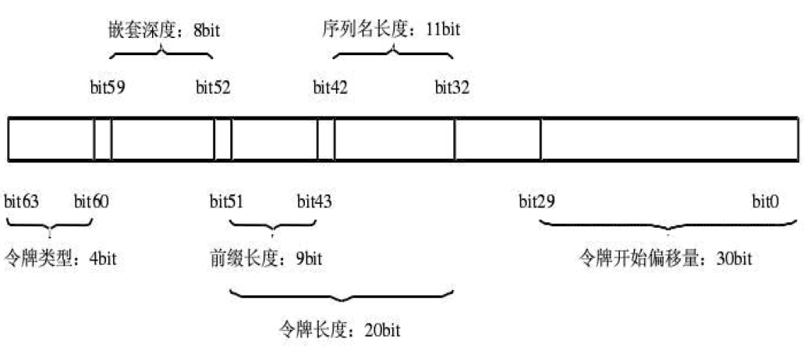

1. 令牌开始偏移量(即相对于XML文档头部的距离)是30 bits，能解析的最大文件是1G。令牌长度为20 bits，即一个令牌的最大长度是1M。令牌类型4bits，说明支持16种词汇类型

## 5.9. 面向应用的对象式解析技术
1. 有的程序关心文档的XML结构；有的应用程序仅仅将XML作为数据交换的媒介，它们更关心的是文档数据本身
2. 数据绑定是指将数据从一些存储媒介(如XML文档、文本文件和数据库)中取出，并通过应用程序表示这些数据的过程，即把数据绑定到虚拟机能够理解并且可以操作的某种内存中的结构
3. Hibernate就是针对数据库的轻量级数据绑定框架

### 5.9.1. 数据绑定的应用
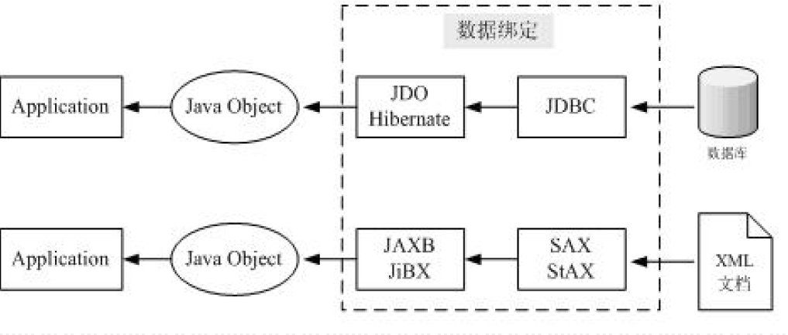

1. 编组(Marshalling) ：把内存中的数据转换到存储介质中的过程。
2. 解组(Unmarshalling) ：把数据从存储媒介转换到内存中的过程
3. 映射(Mapping) ：用于编组和解组的一套规则

## 5.10. 文档模型和数据绑定模型比较
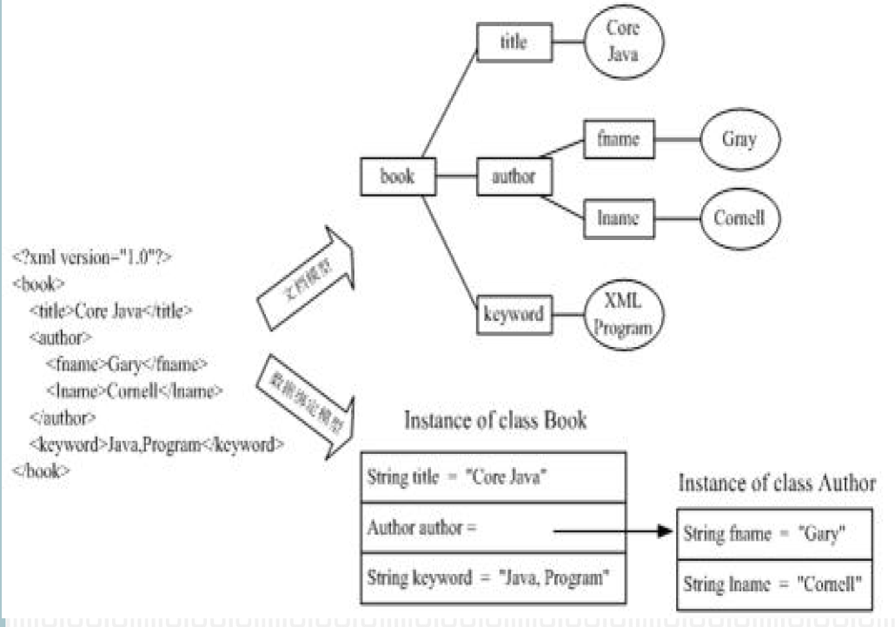

## 5.11. 四种XML解析技术的特性比较


## 5.12. 面向文档解析方式的性能比较

