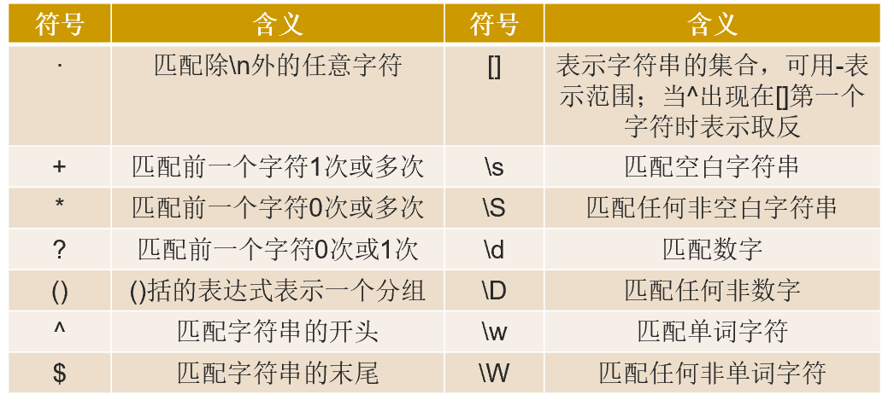
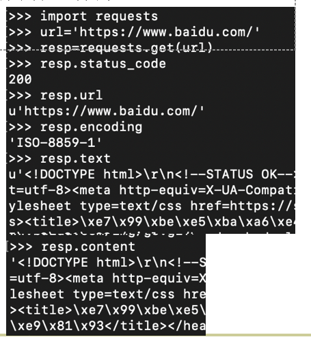
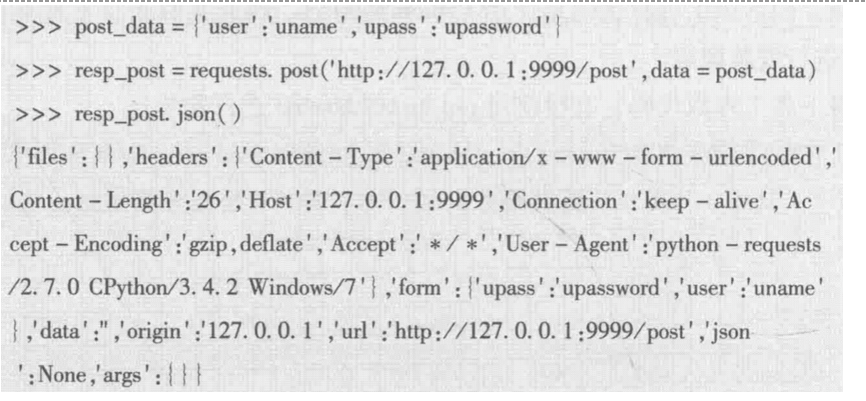
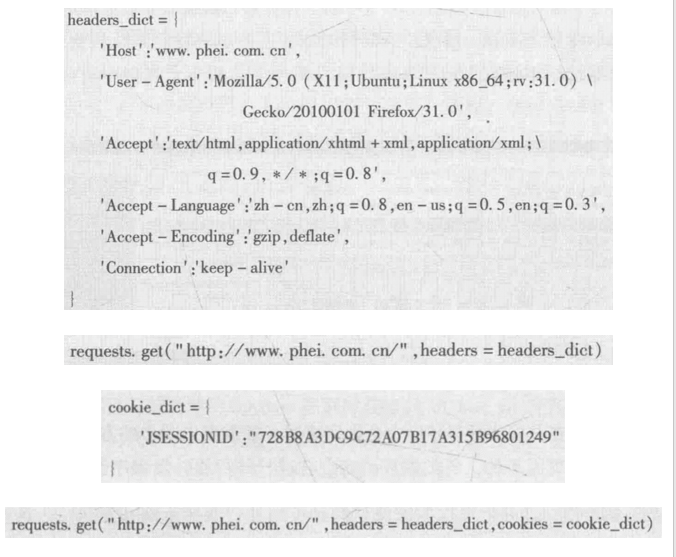

Lec4-Python数据爬取技术与实战
---

# 1. 字符串解析
1. xls是二进制文件

## 1.1. 常用函数
Python提供了基本字符串方法，可以对字符串进行简单处理。方法包括split()、replace()、strip()等。

## 1.2. 正则表达式
复杂的字符串处理可以使用正则表达式，下表展示了常用的正则表达式。



1. 正则表达式详细教程详见https://www.w3cschool.cn/zhengzebiaodashi/。
2. Python的re模块提供了大量的方法，实现了正则表达式的各类操作。详细的使用说明见https://docs.python.org/3/library/re.html。
3. 以下实例给出正则表达式的一些简单使用方法。


## 1.3. 字符串解析BeautifulSoup
1. 	BeautifulSoup 是一个HTML/XML的解析器，主要功能是解析和提取 HTML/XML 数据。
2. BeautifulSoup4将复杂HTML文档转换成一个复杂的树形结构,每个节点都是Python对象,所有对象可以归纳为4种:
   1. Tag:标签，有name和attrs两个重要的属性
   2. NavigableString:标签内部的文字
   3. BeautifulSoup:表示的是一个文档的内容，可以将其当成一个特殊的Tag。
   4. Comment:是一个特殊类型的 NavigableString 对象，其输出的内容不包括注释符号。
3. 更多信息详见https://www.crummy.com/software/BeautifulSoup/bs4/doc/。
4. 示例

```py
from bs4 import BeautifulSoup
import re
file = open('./aa.html', 'rb')
html = file.read()
bs = BeautifulSoup(html, "html.parser")
#查询id=head的Tag
t_list = bs.find_all(id="head")
print(t_list)
#查询href属性包含ss1.bdstatic.com的Tag
t_list = bs.find_all(href=re.compile("http://news.baidu.com"))
print(t_list)
#查询所有包含class的Tag(注意: class在Python中 属于关键字，所以加_以示区别)
t_list= bs.find_all(class_ =True)
for item in t_list:
  print(item)
```

5. json结构:数据处理中经常会遇到json格式的文档。Python提供了json模块用于json格式内容的处理。
   1. json.dumps: 将Python对象编码成JSON字符串
   2. json.loads: 将已编码的JSON字符串解码为Python对象

# 2. 单机数据爬取
1. Spynner：Sypnner是基于pyqt的一种库，封装了pyqt强大的webkit，具有执行javascript的能力，使用Spynner可以完全模拟一个浏览器的功能和行为。在抓取的时候可以动态显示整个抓取进展。使用Spynner可以对javascript实现的动态内容进行抓取。详见https://pypi.org/project/spynner/。
2. requests：request是Python的http库，可以完成绝大部分与http应用相关的工作。与Spynner不同，requests是一种非界面化的库，它提供了丰富的且易于调用的多种方法实现对http相关方式的模拟。

## 2.1. Spynner
```py
import spynner
import pyguery
import time

from bs4 import BeautifulSoup
browser = spynner.Browser()
browser.create_webview()
browserset html_parser(pyquery.PyQuery)
browser.load("http://list.jd.com/list.html?cat=670,671 ,672", load_timeout=20)
try:
  browser.wait load(10)
except:
  pass
string = browser.html
browser.close()
soup = BeautifulSoup.BeautifulSoup(string)
time.sleep(2)
tags1 = soup.findAll('div', {'class': 'sl-wrap'})
for tag in tags1:
  print(tag)
```

1. 爬取京东中"电脑"页面的信息，基本的流程是创建一个browser，打开指定url,等待加载完成后，读取browser中 的html进行解析，然后获取指定div节点列表,再通过一个for循环来遍历所有笔记本的信息并打印出来。

## 2.2. requests
1. 我们主要围绕两个基本方法get和post的相关内容进行介绍。

### 2.2.1. get方法
1. 下图展示了一个简单的get方法的例子。get的返回值resp是一个Response类的对象，对象的text属性包含了相应的HTML文本。response的属性还包括url、status_code、encoding等，方法有json()等，可以使用help(resp)查看response的各种属性和方法。



### 2.2.2. post方法
1. post在提交时需要提供类似表单的数据信息。



### 2.2.3. header和cookie
1. 在抓取时可能对方会判断是否发送请求的一方是浏览器，如果是浏览器才进行响应，这样就需要将我们的request在请求时伪装成一个浏览器，通常的做法是设置headers。在实际抓取环境中，可以使用浏览器自带的开发控制台获得实际的headers。有时也需要设置cookie，获得方法与获得headers方法类似。



# 3. Selenium
1. Selenium主要用于Web开发领域的自动化测试，其提供的接口和方法也可用于数据抓取领域，基于grid技术可以方便地搭建分布式抓取环境。相比Spynner，Selenium的功能更为完备，文档资料也更加丰富。
2. 利用Selenium可以实现对多种浏览器的调用，如Firefox、Chrome、IE、Opera等，基本的使用流程是相似的。
3. 以FireFox为例来说明使用Selenium进行网页抓取的流程。抓取的目标为电子工业出版社网站，抓取首页http://www.phei.com.cn/，代码为

```py
#利用webdriver可以初始化各种浏览器
from selenium import webdriver
#为了在后面调用sleep函数，在页面加载后有一定的时间间隔用于观察
import time
#初始化一个Firefox浏览器用于抓取的实施
firefox = webdriver.Firefox()
#抓取的目标网页地址
url = 'http://www.phei.com.cn/"
#调用get方法抓取
firefox.get(url)
#有10s等待时间用于观察
time.sleep(10)
#将加载的页面保存在本地，存储的是页面加载后的HTML文本.
with open(a.html', 'w', encoding='utf8') as f:
f.write(firefox.page_ source)
#抓取完毕后，调用quit()方 法退出浏览器
firefox.quit()
```

## 3.1. Selenium的Profile配置
1. Selenium在浏览器初始化时可以对浏览器的相关参数进行设置：
   1. 控制CSS。因为在抓取时只关心页面重要信息的获取，因此CSS样式表文件的加载和对页面的渲染是没有必要的，这在一定程度上可以减少抓取时间。
   2. 控制Javascript文件的加载和执行。如果我们关注的信息内容不是利用Javascript动态加载得到的，而且关注的信息在展示后还有大量的无关信息加载时，可以关闭Javascript的加载和执行功能。
   3. 控制图片的加载，极大的提高抓取效率。

## 3.2. Profile的配置示例
```py
from selenium import webdriver
import time
firefox_profile = webdriver.FirefoxProfile() #初始化一个Firefox实例firefox_ profile
firefox_profile.set_preference( "permissions.default.stylesheet", 2) #禁用样式表文件
firefox_profile.set_preference( "permissions.default.image", 2) #不下载和加载图片
firefox_profile.set_preference( "javascript.enabled" , False) #禁止Javascript的执行
firefox_profile.update_preferences() #更新设置
#利用firefox_ profile 初始化浏览器，此时浏览器初始化Firefox具有参数所设定的行为
firefox = webdriver. Firefox(firefox_profile)
url = 'http://www.phei.com.cn/
t_start = time.time()
firefox.get(ur)
print('loading time is: ', time.time()-t_start)
time.sleep(10)
firefox.quit()
```

## 3.3. 动态内容抓取
1. 雪球网的帖子是动态加载的，我们以此为例使用Selenium爬取帖子
2. 使用request无法抓取到全面的数据（如下图所示，无法获取全部的数据）。因为网页的内容是随着滚动逐步加载的。根据这一特点，可以使用Selenium来完成抓取工作。

```py
import requests
url = 'https://xueqiu.com'
headers = {
  "User-Agent":"Mozilla/5.0 (Windows NT 10.0; Win64; x64) AppleWebKit/537.36 (KHTML, likeGecko)"
  "Chrome/74.0.3729. 108 Safari/537 .36",}
cookie = {'ID':"1 586965804'}
resp = requests.get(url=url, headers=headers, cookie=cookie)
S = resp.text
print(len(s))
with open( 'xueqiu.html', w, encoding='utf8') as f:
  f.write(s)
```

1. 下面的实例利用Selenium执行Javascript脚本的能力，利用脚本来控制浏览器的滚动条，并通过滚动条的滚动动态加载内容。

```py
import time
import json #用于格式化存入文件
from selenium import webdriver #自动化测试工具
from lxml import etree #使用xpath解析
"""
1.爬取雪球网，获取url
2.使用自动化测试工具打开雪球网
3.需要使用自动化测试工具循环下拉滚动条三次，获取到动态加载的数据
4.然后使用自动化测试工具点击加载更多的button按钮，来获取到更多的数据
5.对获取到的数据进行解析,拿取需要的数据
6.将数据循环以词典添加到列表中
7.将列表数据写入到文件中,并且需要将列表转换为json字符串
"""
starttime=time.time()#开始时间，用于测试爬虫的时长
url ="https://xueqiu.com" #雪球网的url,默认就为推荐数据
#实例化浏览器对象,以谷歌浏览器运行，
browser = webdriver.Chrome()
browser.get(urI) #打开对应的url
#下拉滚动条三次,三次之后就需要点击加载更多的按钮，可自己下拉查看
for i in range(3):
browser.execute_script('window.scrollTo(0, document.body.scrollHeight')
time.sleep(1 .5)
#获取加载更多的按钮
button = browser.find_element_by_class_name("AnonymousHome_home_timeline_more_6RI")
try:
#循环点击这个按钮，并且下拉获取到更多的数据,此处循环自行设置,可以不必循环太多次
  for i in range(3):
    button.click() #点击这个按钮
    #点击按钮之后会展示更多的数据,然后继续下拉滚动条来获取加载更多按钮
    browser.execute_script('window.scrollTo(0, document.body.scrollHeight)
    time.sleep(2)
except Exception as e:
  print('出错了:', e)
else:
  #如果没有出错,那么则获取到了全部(大量)的数据,下面要对数据进行解析,取出所需数据
  #获取到的网页源码就是str类型，不需要再使用text获取htm|文本数据
  tree = etree.HTML(browser.page_ source)
  #获取到所有的a标签
  a_list = tree.xpath('/div[@class="AnonymousHome_home_timeline_item_3vU"]/h3/a' )
  result_list= []
  for a in a_list:
    result_ dict = dict()
    title = a.text #标签中的文字可直接使用text获取文本或者再次使用xpath匹配
    #因为xpath匹配出来后的数据是放在列表中,所以要从列表中拿出来
    href = url + a.xpath('./@href' )[0]
    result_dict["title"] = title #将数据添加到字典中
    result_dict["ur"]= href
    result_listappend(result_dict) #将字典添加到列表中
    #此处循环完毕后列表中有多个字典,可以将列表写入文件(数据库)中，以便查看数据
  with open('xue_qiu.json' ，'w' , encoding=‘utf-8’ ) as f: 
  #写入文件要将python格式转换为json字符串写入
    f.write(json.dumps(result_list, ensure_asci=False, indent=2))
  browser.quit() #退出浏览器
print("总耗时:%d" % (time.time() - start_time)) #打印爬取数据的总时长

```

# 4. Tor
1. Tor是一种开源的网络工具，使用Tor可以防止他人了解到我们的位置和访问习惯。
2. Tor可以将我们发出的请求在接入的网络中传送，然后通过在某个也接入到Tor网络系统中的机器将请求发送到目标站点，得到响应后，Tor再将响应传回我们的机器。这个过程比常规的访问方式要长，但有一个特点是可以控制Tor。Tor就像一个“IP泵”一样，源源不断的产生各种IP，为我们发送请求。
3. 抓取时IP被封锁的问题
   1. 通常，网站会对访问设置一定的规则，对于抓取来说，主要面对的问题是对抓取频次的限制。当抓取过快时，如果超过这一限制，网站就会进行阻止和封锁。不同的网站有不同的封锁策略，主要表现为在一段时间内，用户无法访问，直至网站解除对此IP的封锁
4. Tor实施抓取具有以下特点：
   1. 可以生成不同的可用IP地址对目标进行访问；
   2. 本机操作相对于各种免费代理更加可靠和稳定；
   3. 无需费用，Tor是一种免费的软件。
5. 下面的代码的主要工作是在Tor的协助下进行数据抓取。每一次抓取会使用不同的IP地址。

```py
import socks
import socket
from stem:control import Controtler # stem是控制Tor的库
from stem import Signal
import requests
import time
counter= 0 
controller = Controller.from_port(port=9151)
controller.authenticate()
socks.setdefaultproxy(socks.PROXY_TYPE_SOCKS, "127.0.0.1", 9150)
socket.socket = socks.socksocket
url_ip = 'http://jsonip.com/'
url_pub = 'http://www.phei.com.cn/
while counter < 5:
  try:
    r = requests.get(url_ip)
    ip_val = r.json()['ip']
    print(counter, '当前ip:', ip_ val)
    time1 = time.time()
    r2 = requests.get(url_ _pub)
    print(counter, '抓取时间:, time.time() - time1)
    with open(ip_ _val + ' _pub.html', 'w', encoding='utf8') as f:
    f.write(r2.text)
    time2 = time.time()
    controller. signal(Signal.NEWNYM)
    time.sleep(controller.get_ newnym_ wait()
    print(counter, '改变IP时间: ', time.time() - time2)
    counter = counter + 1
  except Exception as e:
    print(e)
```
# 5. 爬取常见问题
1. Flash：Flash与服务器间的通信有时会将请求加密，同时返回的信息也被加密。可以通过对Flash控件的分析找出加密和解密对应的模块，进而分析出密钥，在拥有密钥的情况下，整个过程就变得透明和简单。
2. 桌面程序或App
   1. 使用Wireshark进行辅助分析监控整个系统通过网络和外界进行交互时的协议使用情况和协议的内容。
   2. 设置Wifi热点，使移动设备通过该热点连接网络，利用Wireshark对热点进行网络流量的分析，从而抓取App通过热点与服务器交互的请求和响应数据。
3. 图片的处理
   1. 目标网站可能出于信息保护的目的，将一些关键的信息，尤其是数字相关信息以图片的方式展示出来。我们可以将图片中的数字转化为文本数字。转化的方式可以使用PIL库来执行，或者寻找其他的库，如大多数机器学习库中包含的一些监督式学习算法，经适当修改后也可以用作数字的识别与处理。
4. 设置请求时间间隔
   1. 大规模集中访问对服务器的影响较大，爬虫可以短时间增大服务器负载。等待时间过长，不能满足短时间大规模抓取的要求，等待时间过短则很有可能被拒绝访问。
   2. 设置合理的请求时间间隔，既保证爬虫的抓取效率，又不对对方服务器造成较大影响
