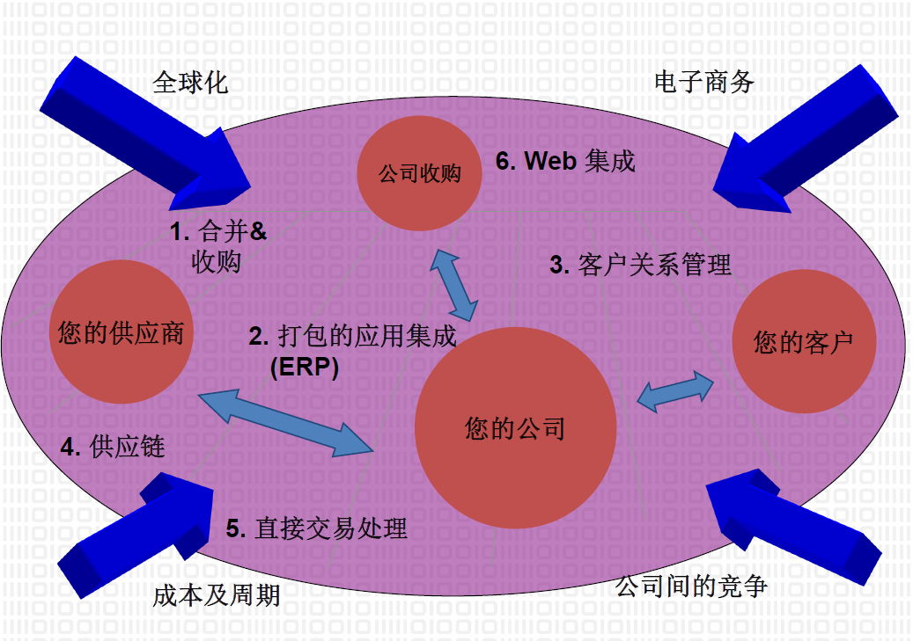

企业应用集成
---

# 1. 为什么

## 1.1. 应用环境图例
1. 多应用系统共存，系统或者交叉互连，或者相互孤立
2. 多操作系统、多数据库系统、多技术平台共存
3. 用户需要在不同系统中切换

## 1.2. 信息孤岛
1. 缺乏不同系统之间的互操作性
2. 交叉公共数据的冗余和一致性问题
3. 各系统的异构性使得难以全局信息分析和处理
4. 数据和数据处理紧密绑定，缺乏柔性，不能快速适应变化

## 1.3. 信息化环境的变化
1. 应用软件通过Internet或WAN分布在世界范围
2. 数以百万/千万计的用户，可能存在的突发事件
3. 用户和应用程序间的连接是非持久性的和低速的
4. 千差万别的数据表示设备
5. 应用程序所需的数据可能分布在不同的机器上
6. 全球化的协同工作

## 1.4. 数据集成案例
1. 美国家庭互联网接入公司FullServe收购欧洲信用卡供应商EuroCard

2. 在FullServe和EuroCard的案例中，多个数据库是通过收购兼并得到的。公司进行内部重组时，应及时调整相应的数据库
3. 当FullServe服务部门和产品部门被合并时，可能并没有合并其数据库，因此公司有两个单独的数据库
4. 当创建数据库时，创建人并不能预见公司未来的所有信息需求以及他们今天存储的数据将来可能会有其他的用途
5. FullServe有一个客户服务热线，客户可以打电话咨询他们从公司获得的任何服务或产品
6. 假设FullServe想与其他厂商一起提供一套品牌服务。在这种情况下，FullServe需要为其他网站提供一个Web服务，为访问这些网站的客户提供一个单点登录
7. FullServe需要知道他们的员工在加入公司之前是否在其竞争对手或合作伙伴的公司里工作过。要应答这样的查询就会涉及将员工数据库和简历数据库合起来
8. 把客户服务热线（HelpLine）数据库和销售（Sales）数据库中的数据结合起来，将帮助FullServe在早期发现他们的产品和服务中的问题。发现不同产品的使用趋势可以使FullServe积极主动地设定和维持库存水平

## 1.5. 企业信息化发展阶段

## 1.6. 商业集成的需要

## 1.7. 信息系统开发工具的选择
1. 基于VB、Delphi、PowerBuilder等开发工具
   1. 数据处理能力强、访问速度快、适用范围广
   2. 可伸缩性和扩展性较差，而且开发工作量大
2. 基于Domino/Notes、Exchange等群件系统
   1. 完善的通信手段和非结构化数据支持能力，可伸缩性和扩展性好，提供安全权限和工作流管理机制，易于安装和维护
   2. 处理结构化数据能力较弱，开发工具缺乏灵活性，不擅长数据的计算、分析、统计，运行效率较低，可开发性差，不利于进行多种复杂应用的集成
3. 基于.net或Java技术，采用Browser/WebServer软件结构

## 1.8. 企业信息化的挑战
1. 保护已有的投资
2. 将来的不确定性
3. 价值链的集成
4. 技术的整合
5. 重用和团队的开发
6. 多种技术的需求：有限的经验
7. 对于上千万用户的可扩展性

## 1.9. EAI的优势
1. 增进与客户的联系
2. 增强供应链间的联系
3. 改善内部流程
4. 减少市场化周期

## 1.10. 常见的EAI需求
1. 信息门户
2. 数据复制
3. 共享的业务功能
4. 面向服务的体系结构
5. 分布式的业务过程
6. 企业到企业的集成

## 1.11. Automated Business Processes

# 2. 是什么

## 2.1. 企业应用集成(EAI)
1. 实现在组织内、外的各种异构系统，应用和数据之间共享和交换信息和协作的途径，方法学，标准和技术
2. 集成是一种把多个系统的数据和功能组合或连接成一个具有凝聚力的集合的方法
3. 多个系统之间各种互操作的一致性。
4. 应用集成是将基于各种不同平台、用不同方案建立的异构应用集成的一种方法和技术。
5. 应用集成为应用提供了一种一致无缝的认知和操作模型

## 2.2. 应用集成的前提
1. 多个模块组成的复合应用，其中的这些模块可以相互调用或进行合作
2. 理解并保持应用系统之间相互关联和操作
3. 数据共享和通讯

## 2.3. 三个目标
1. 对不同应用中的数据提供访问接口
2. 保证相关信息之间的依赖关系和约束条件
3. 程序互操作

## 2.4. 技术要求
1. 能提供应用间的互操作性
   1. 信息的有意义交换
   2. 功能服务：资源的动态发现，动态类型检查
2. 能提供分布式环境中应用的可移植性
   1. 不会破坏应用所提供的或正在使用的服务
   2. 静态的系统重新部署以及动态的系统重构
3. 能提供系统中应用分布的透明性：实现细节，复杂性

## 2.5. 应用集成的历史
1. 60年代到70年代
2. 80年代：点到点(point-to-point)的集成，信息和数据共享
3. 80年代末和90年代初：CORBA、DCOM、MOM
4. 90年代中后期：业务流程集成技术BPI
5. 21世纪以来：B2B与B2C、XML、Web Service、SOA

# 3. 有什么

## 3.1. 集成模型
1. 集成软件的特定方法和结构
2. 对集成模型的关注点
   1. 实现集成简单性
   2. 对于不同配置集成的可重用性
   3. 可用集成方法的广泛度
   4. 在执行集成的过程中要求的专门技术

## 3.2. 集成模型种类
1. 表示集成：软件用户界面
2. 数据集成：直接访问软件创建、维护并存储的信息
3. 功能集成：代码级别的软件集成
4. 业务流程集成：商务逻辑
5. B2B集成：不同贸易协议

## 3.3. 表示集成模型

### 3.3.1. 应用场景
1. 为原来基于终端的应用软件提供PC界面
2. 提供一个由多组件合成的应用软件
3. 案例
   1. 为大型机提供windows界面
   2. 为SAP R/3与大型机程序提供统一的HTML界面
   3. 为多个大型机应用程序提供统一的基于Java的界面

### 3.3.2. 表示集成的特点
1. 易于实现
2. 结构简单清楚
3. 性能瓶颈
4. 屏蔽原有接口
5. 功能有限

## 3.4. 数据集成
1. 批量文件传输
2. 开放式数据连接ODBC
3. 数据库访问中间件
4. 数据转换

### 3.4.1. 数据集成模型

### 3.4.2. 应用场景
1. 多个信息源综合数据进行分析和决策
2. 向多个应用软件提供公共信息源的只读权限
3. 以一个信息源的信息来更新另一个数据源
4. 案例
   1. 综合sybase、DB2和SAP P/3数据库中的数据
   2. 使用大型机和Oracle的可执行信息系统
   3. 允许其他应用程序在peoplesoft和定制的Oracle数据库中获取数据 

### 3.4.3. 数据集成的特点
1. 更广泛的数据访问
2. 简化数据库访问
3. 方便新数据源的集成
4. 系统逻辑演变的维护工作

## 3.5. 功能集成模型

### 3.5.1. 分布式处理中间件
1. 面向消息的中间件MOM：IBM.MQSeries
2. 分布式对象技术：OMG.CORBA；COM+；J2EE
3. 事务处理监控器：BEA.Tuxedo

### 3.5.2. 应用场景
1. 能够解决前两种方法可解决的问题
2. 要求新软件具有其他程序的功能
3. 在集成中暗含工作流
4. 确保应用间的事务完整性
5. 案例
   1. 获取用户信息，对java程序、大型机程序、Oracle数据库作更新
   2. 把供应商的系统集成到采购系统中

### 3.5.3. 功能集成的特点
1. 集成能力强
2. 更高的重用性
3. 复杂度增加

### 3.5.4. 业务流程集成模型

## 3.6. 业务流程
1. 为在一定时期内达到特定的商业目标，而按照各种商务规则连接起来的业务功能集
2. 具体实现受限于业务功能运行所必须的可用资源，包括业务人员，IT业务应用系统，客户，和商务交往及贸易伙伴等
3. 在业务流程中，商务规则或者表现为条件和限制，或者表现为实施并发、串行等流程中的行为（Activity）节点

### 3.6.1. 业务流程集成的技术成分
1. 业务流程引擎
2. 资源管理工具
3. 调度工具
4. 审计管理工具
5. 错误管理工具
6. 资源库:业务流程集成层资源库中可存储多种数据对象

### 3.6.2. 应用场景
1. 通过子流程来实现业务流程共享
2. 支持技术和商务标准协议
3. 支持快速实施
4. 帮助企业获得全面业务透视能力，从而让企业可以全面掌控业务

### 3.6.3. 流程集成应用开发模式

## 3.7. B2B电子商务
1. 企业与企业之间通过网络进行产品、服务及信息的交换：信息标准化、身份验证
2. 将买方和卖方集中到一个市场上进行信息交流、广告、拍卖竞标、交易、库存管理

### 3.7.1. B2B模式

### 3.7.2. B2B集成场景
1. 企业内部的多个应用系统与多个外部信息系统进行交互
2. M×N交互场景（M个内部系统与N个外部系统进行交互）
3. 每个系统都有各自的数据交换格式，这些格式不一定需要被外部系统所理解。

### 3.7.3. B2B集成解决方案（宏观）
1. 接收及验证发往外部信息系统以获取一些业务数据的请求消息
2. 选择某个外部信息系统（商家）来获得请求的数据
3. 运行一些可能针对具体请求环境的业务规则
4. 创建命令，规定适合于所选择的外部信息系统的格式
5. 通过商家支持的传输协议，把含有商家数据格式命令的请求消息传送给对方
6. 对外部信息系统的响应采用的步骤类似对出站命令请求采用的步骤（譬如验证和数据转换）
7. 管理与外部信息系统的联系以及定义事务

### 3.7.4. B2B系统的主要部分
1. 用于接收客户请求和外部信息系统响应的事件侦听器：服务器小程序
2. 定义集成工作流中逻辑步骤的流程定义：用隐式方式拥有事务管理逻辑
3. 流程定义用来执行该步骤的支持组件：数据验证、转换和业务规则执行

## 3.8. 技术组成
1. 通信模式
2. 集成方法
3. 中间件技术
4. 服务

### 3.8.1. 通信模式
1. 同步通信
   1. 请求/应答
   2. 同步轮询
2. 异步通信
   1. 消息传送通信
   2. 发布/订购通信
   3. 广播通信

### 3.8.2. 集成方法
1. 消息传递
2. 接口调用

### 3.8.3. 中间件技术
1. 远程过程调用
2. 数据库访问的中间件
3. 面向消息的中间件
4. 分布式对象技术
5. 事务处理监控器

### 3.8.4. 服务
1. 目录
2. 生存周期
3. 安全
4. 变换和转换
5. 连续性
6. 事件
7. 通知
8. 工作流

# 4. 目前的问题

## 4.1. 一致性问题
1. 异构性
   1. 设置映射关系解决子模块间不一致的命名、取值、格式、描述以及调用序列问题
   2. 提供触发机制以维持模块间的依赖关系并保证限制条件
2. 子系统的自治性
3. 集成和透明

## 4.2. EAI面临的障碍
1. 混乱的体系结构
2. 技能欠缺
3. 安全问题

