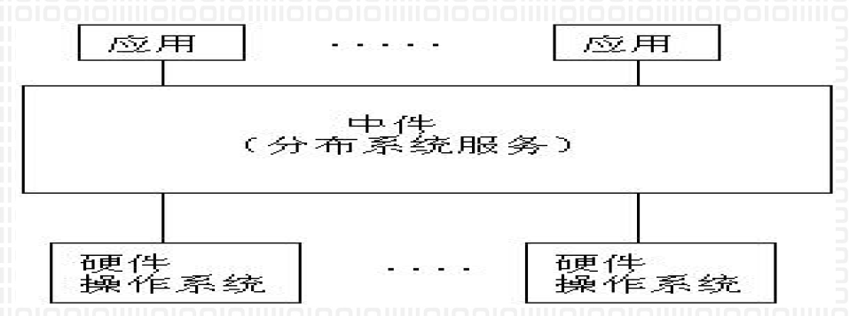
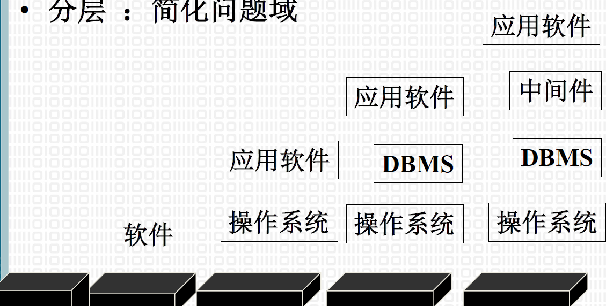
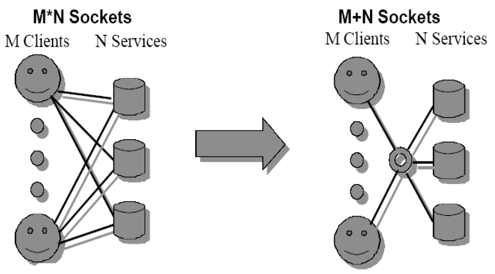
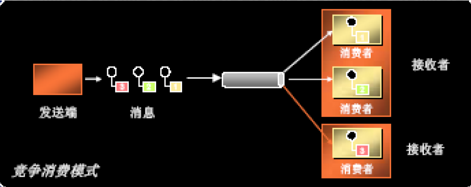
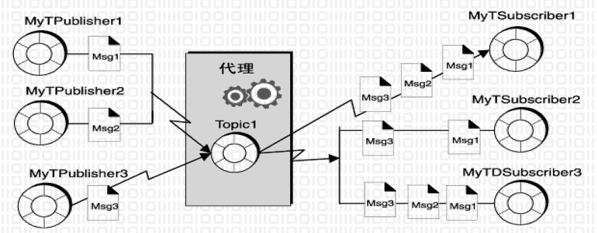
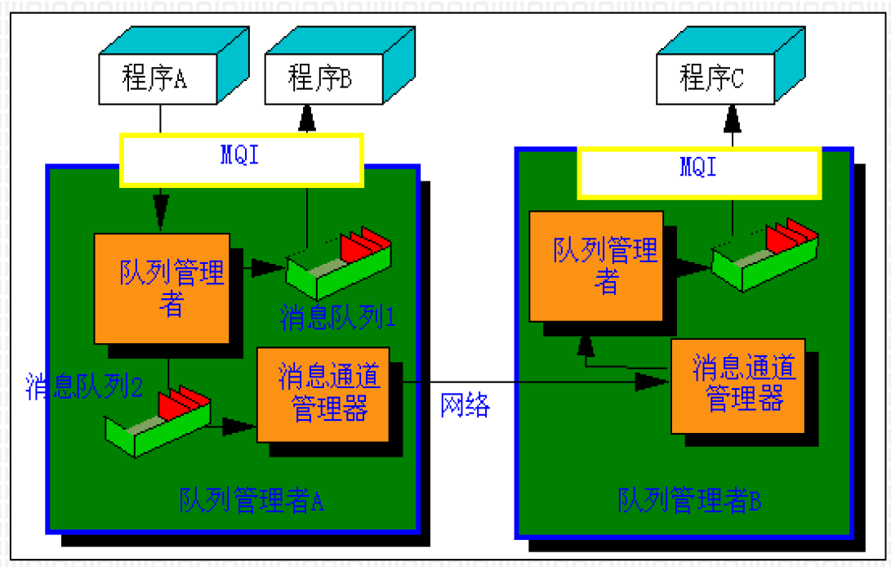
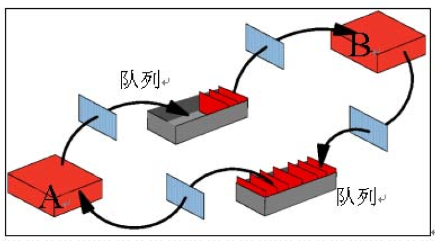
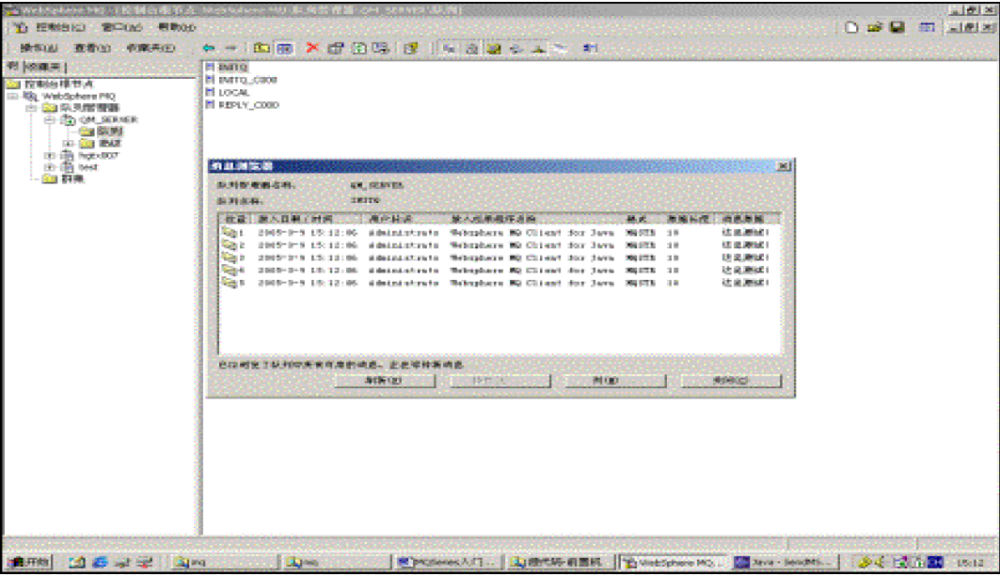
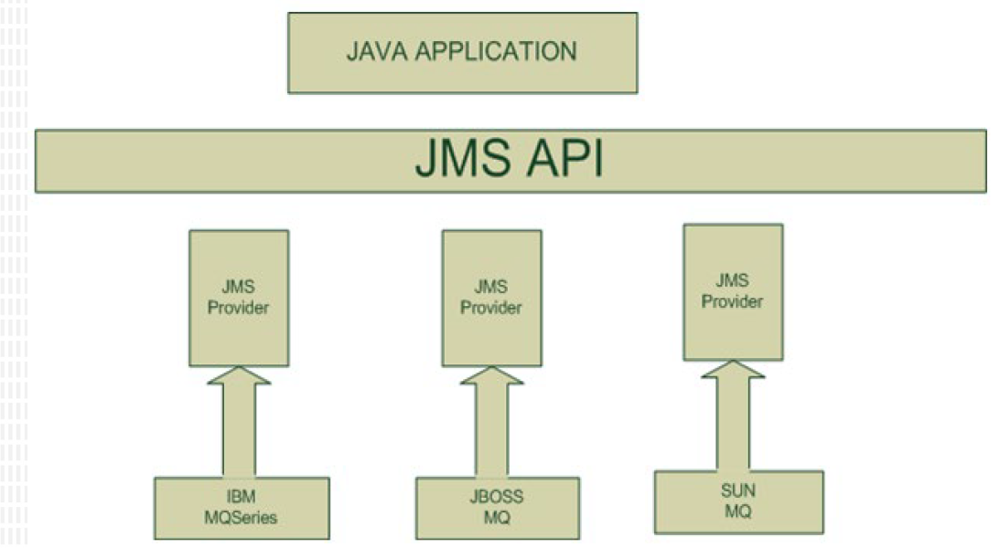

消息中间件
---

# 1. 概述

## 1.1. 集成的问题
1. 遗留应用系统之间的数据共享和通讯
   1. 文件传输
   2. 共享数据库
   3. 远程过程调用
   4. 消息传递
2. 不同硬件平台、网络协议、操作系统甚至编程语言

## 1.2. 中间件技术


1. 基础软件的一大类，属于可复用的软件范畴，是位于平台和应用之间的通用服务
   1. 数据访问中间件
   2. 远程过程调用中间件
   3. 分布式对象中间件
   4. 消息中间件
   5. 事务处理中间件

## 1.3. 中间件的技术思想
1. 复用：软件不断完善，可靠性、通用性和有用性不断提升
2. 分层：简化问题域



## 1.4. 分布式对象技术的局限性
1. 同步通信：客户发出调用后，必须等待服务对象完成处理并返回结果后才能继续执行
2. 客户和服务对象的生命周期紧密耦合：客户进程和服务对象进程都必须正常运行，如果由于服务对象崩溃或网络故障导致客户的请求不可达，客户会接收到异常
3. 暴露行为：IDL 增加复杂性

## 1.5. Advantages: Scalable Architecture
1. Simplistic RPC or CORBA frameworks: M*N sockets
2. MOM frameworks: M+N sockets



## 1.6. 消息中间件
1. 消息传递：应用连接到一个公共的消息传递系统上，并通过消息来交换数据和调用行为
2. 消息中间件
   1. 一种由消息传递机制或消息队列模式组成的中间件技术
   2. 分布的平台之间发送和接收信息的基础架构
   3. 可以提高应用之间的互操作性、灵活性和可移植性

## 1.7. Advantages
1. 通讯程序可在不同的时间运行
   1. 消息放入适当的队列时，目标程序甚至根本不需要正在运行
   2. 即使目标程序在运行，也不意味要立即处理该消息
2. 对应用程序的结构没有约束
   1. 在复杂的应用场合中，通讯程序之间不仅可以是一对一的关系，还可以进行一对多和多对一方式，甚至是多种方式的组合
   2. 多种通讯方式的构造并没有增加应用程序的复杂性

## 1.8. 为什么要使用消息传递
1. 灵活性
2. 可缩放性
3. 高负载的平缓释放
4. 集成性

### 1.8.1. 灵活性
1. 更多的数据流选择：Fire-and-forget, multicast, balancing, flow control, priority routing 等.
2. 多粒度的处理逻辑多粒度的处理逻辑
   1. Routing Slip
   2. Content-Based Router
3. 更容易维护和变化
   1. 消息格式的变化不需要重新编译不相关的客户端
   2. 消息流的传递不需要修改中间结点
4. 避免并发死锁(和RPC响应阻塞相比)

### 1.8.2. 可缩放性
1. 竞争消费–多个处理端可以读取同一队列
2. 发送端不需要进行任何改变
3. 粗粒度消息可以使处理端成为"无状态"



### 1.8.3. 高负载的平缓释放
1. 队列中存储的消息将会等待被处理
2. 消息处理端或消费者会尽可能快地取走消息
3. 如果处理端阶段无法继续:
   1. 增加更多的处理端
   2. 等待峰值负载被释放

### 1.8.4. 集成性
1. 消息传递不需要一致的类型系统
   1. 消息就是类型
2. 消息传递可以连接多个系统(.NET,J2EE,etc.)
   1. XML消息非常适合此类场景
   2. 其它数据表现形式也可用(CSV, 文本)
3. 消息传递的灵活性使得集成更容易

## 1.9. 消息传递面临的挑战
1. 使用队列来通信，而不是对象：双向通信需要至少2个队列：一个用于请求消息，另一个用于响应个队列
2. 不存在会话状态
   1. 时序–消息的到达可能是无序的
   2. 同步通信需要进行更多的设计
3. 不存在对象标识
   1. 消息进入队列，而不是对象
   2. 不符合通常的客户/服务器模式
   3. 类似"生产者消费者"，甚至于"点对点"通信

## 1.10. 消息的中间服务层
1. 通信模型之上增加了抽象层，从而组合了分布式消息发送者和接收者之间的连接
2. 在消息发送者和接收者之间存在一个中间服务，它负责直接将消息从发送者传送给接收者，并且通过特定的机制保证发送者并不在它们传送的消息之上阻塞
3. 异步地从消息发送者接收消息，并且将消息路由到消息接收者。要传递消息的客户程序使用消息中间件接口，以一种透明的方式调用消息传递服务

## 1.11. 消息中间件的特点
1. 通信程序可在不同的时间运行：程序不在网络上直接相互通话, 而是间接地将消息放入消息队列, 因为程序间没有直接的联系, 所以它们不必同时运行。
2. 对应用程序的结构没有约束：多种通信方式不会增加应用程序的复杂性：程序与网络复杂性相隔离
3. 程序将消息放入消息队列或从消息队列中取出消息来进行通信，与此关联的全部活动是MOM的任务，程序不直接与其他程序通信，也不涉及网络通信的复杂性

## 1.12. 消息中间件的优点
1. 异步通信：发送消息者可以在发送消息后进行其它的工作，不用等待接收者的回应，而接收者也不必在接到消息后立即对发送者的请求进行处理
2. 客户和服务对象生命周期的松耦合关系：客户进程和服务对象进程不要求都正常运行，如果由于服务对象崩溃或者网络故障导致客户的请求不可达，客户不会接收到异常，消息中间件能保证消息不会丢失
3. 应用相互解耦和

# 2. 消息传递系统

## 2.1. 消息
1. 数据的载体，任何想要通过消息传递系统传送的数据都必须换成一个或多个消息，从而通过消息通道发送
2. 数据一般作为字节流传送，发送者把数据编组（Marshal）为字节形式
3. 消息首部：由消息传递系统使用的信息，用于描述所传送的信息、信源和信宿等等
4. 消息体: 被传送的数据，一般被消息传送系统忽略，只是原封不动地传送

## 2.2. 消息通道
1. 消息传递系统中特定类型消息的容器
2. 应用不是把信息注入到消息传递系统中，而是把信息添加到一个特定的消息通道中
3. 接收信息的应用也是从一个特定的信息通道中获取信息
4. 消息通道是消息传输系统中的逻辑地址，其如何具体实现依赖于消息传递系统产品及产品本身的实现
5. 一般采用字母数字组成的名字命名，如MyChannel

## 2.3. 管道和过滤器
1. 一个事件会触发一系列的处理步骤，每个步骤都要完成特定的功能
2. 需要用管道和过滤器的体系结构来灵活可靠地实现消息处理的任务，把较大的处理任务划分成一系列较小的独立处理步骤（过滤器），这些步骤由管道连接起来
3. 管道和过滤器模式使用抽象管道使组件相互之间实现了解耦合

## 2.4. 消息路由
1. 多个应用可把消息发布到同一个消息通道中，消息通道中包含来自不同数据源的消息，这些消息根据一些标准来区别对待
2. 需要利用管道和过滤器的可组合性来实现消息通道的路由功能。通过在两个过滤器之间插入另一个过滤器，由它来决定下一步要执行的步骤
3. 消息路由器与管道和过滤器的基本概念不同，因为它要连接多个输出通道
4. 新的消息类型，增加了新的消息组件，或者修改了路由规则

## 2.5. 消息转换器
1. 应用集成很多情况下要在已有的系统之间实现消息的路由：遗留系统、封装好的应用、自定制的应用、由外部合作伙伴操控的应用
2. 在其他过滤器或应用之间使用一种特殊的过滤器，即消息转换器，把一种数据格式转换为另一种数据格式
3. 适配器模式：把组件的接口转换为另一种接口，使之能在不同的上下文中使用

## 2.6. 消息端点
1. 需要一组特定的代码把消息传递的工作与应用连接和组合起来，从而实现消息传递。这组代码就是消息端点
2. 消息端点是一个特殊化的通道适配器组件，要为应用定制开发，并集成到应用中
3. 消息端点可以用于发送或接收消息，但是同一个实例不能同时做这两项操作。
4. 端点是通道相关的，因此一个应用会使用多个端点与多个通道连接。应用也可以使用多个端点实例与一个通道建立连接，以支持多个并发的进程
5. 消息接收者既可以采用轮询方式，也可以采用事件驱动的方式

# 3. 消息通讯的主要模型

## 3.1. 点对点模型


1. 用于消息生产者和消息消费者之间点到点的通信
2. 消息生产者将消息发送到由某个名字标识的特定消费者，对应于消息服务中的一个队列
3. 队列可以是持久的，以保证在消息服务出现故障时仍然能够传递消息
4. 如果多个接收者都想要消费某一个消息，通道将保证只有其中一个接收者能成功

### 3.1.1. 简单点对点消息传送


1. MyQueueSender向队列目标MyQueue1 发送Msg1，MyQueueReceiver从MyQueue1 获得该消息
2. 点对点通道能确保，对于任何给定的消息只有一个接收者能消费

### 3.1.2. 复杂点对点消息传送


1. 两个发送者MyQSender1 和MyQSender2 使用同一连接向MyQueue1 发送消息。MyQSender3 使用另一连接向MyQueue1 发送消息。在接收端，MyQReceiver1 使用MyQueue1，MyQReceiver2 和MyQReceiver3 共享一个连接以使用MyQueue1 中的消息

### 3.1.3. 点对点消息传送的特点
1. 多个生成方可向一个队列发送消息
2. 接收者可共享连接或使用不同连接，但它们均可访问同一队列
3. 发送者和接收者之间不存在时间上的相关性：客户端发送一条消息后，无论接收者是否正在运行，都能取出该消息
4. 可在运行时动态添加和删除发送者和接收者，这样，即可根据需要扩展或收缩消息传送系统
5. 消息在队列中的放置顺序与发送顺序相同，但它们的使用顺序则取决于消息失效期、消息优先级以及使用消息时是否使用选择器等因素

## 3.2. 点对点模型的优势
1. 由于多个接收者可使用同一队列中的消息，因此如果接收消息的顺序无关紧要，可以平衡消息使用负载
2. 要发送到队列的消息始终保留，即使没有接收者也是如此
3. 客户端可使用队列浏览器对象检查队列内容，然后根据通过该检查所获得的信息来使用消息
4. 在股票交易系统中，每一个完成交易的请求只能由一个接收者接收并处理。因此把这个请求封装为一个消息的时候，它必须放在一个点对点的通道中，以保证安全性

## 3.3. 发布/订阅（Publish-Subscribe）


1. 发布者生成主题中的消息；订户则订阅主题并使用主题中的消息
2. 发布-订阅模型用称为主题（topic）的内容分层结构代替了点对点模型中的惟一目的地
3. 发送应用程序发布自己的消息，指出消息描述的是有关分层结构中的一个主题的信息

### 3.3.1. 简单发布/订阅消息传送


1. MyTopicPublisher向目标MyTopic中发布Msg1。然后，MyTopicSubscriber1 和MyTopicSubscriber2 均从MyTopic接收Msg1 的副本
2. 订户可以是非长期的，也可以是长期的。代理会为所有活动订户保留消息，但对于非活动订户，则只为那些长期订户保留消息

### 3.3.2. 复杂发布/订阅消息传送


1. 多个生成方向Topic1 目标发布消息
2. 多个订户使用来自Topic1 目标的消息。除非订户使用选择器来过滤消息，否则每个订户均可获得发布到所选主题的所有消息
3. MyTSubscriber2 已过滤掉Msg2

### 3.3.3. 发布/订阅消息传送的特点
1. 多个生成方可向一个主题发布消息
2. 多个订户可使用一个主题中的消息。订户可检索发布到一个主题中的所有消息
3. 长期订户可能处于活动状态，也可能处于非活动状态，代理会为它们保留消息
4. 可在运行时动态添加和删除发布者和订户，可根据需要扩展或收缩消息传送系统
5. 消息发布到主题的顺序与发送顺序相同，但它们的使用顺序则取决于消息失效期、消息优先级以及使用消息时是否使用选择器等因素
6. 发布者与订户之间存在时间上的相关性：主题订户只能使用在它创建订阅后发布的消息
7. 发布/订阅模型允许向订户广播消息

# 4. IBM MQSeries

## 4.1. MQ简介
1. IBM 消息中间件
2. 强大的跨平台性，支持的平台数多达35种
3. 业界市场占有率最高的消息中间件产品
   1. 安全机制、简便快速的编程风格、稳定性、可扩展性和跨平台性
   2. 强大的事务处理能力和消息通讯能力

## 4.2. MQ的基本概念
1. 队列管理器
   1. MQ系统中最上层的一个概念，提供基于队列的消息服务
   2. 为应用程序和一些管理工具提供对队列管理器对象的访问
   3. 拥有并维护每个队列，并将接收的消息存储到相应队列
2. 消息：应用程序交由MQ传输的数据
   1. 消息描述符(Message Description或Message Header)，描述消息的特征，消息的优先级、生命周期、消息Id等；
   2. 消息体(Message Body)，即用户数据部分

## 4.3. 消息分类
1. 非永久性(non-persistent)消息
   1. 非永久性消息是存储在内存中的，它是为了提高性能而设计的，当系统掉电或MQ队列管理器重新启动时，将不可恢复。
   2. 当用户对消息的可靠性要求不高，而侧重系统的性能表现时，可以采用该种类型的消息，如：当发布股票信息时，由于股票信息是不断更新的，我们可能每若干秒就会发布一次，新的消息会不断覆盖旧的消息。
2. 永久性(persistent)消息
   1. 永久性消息是存储在硬盘上，并且纪录数据日志的，它具有高可靠性，在网络和系统发生故障等情况下都能确保消息不丢、不重

## 4.4. 队列
1. 消息的安全存放地，队列存储消息直到它被应用程序处理
2. 消息队列的方式工作
   1. 程序A形成对消息队列系统的调用，此调用告知消息队列系统，消息准备好了投向程序B；
   2. 消息队列系统发送此消息到程序B所驻留的系统，并将它放到程序B的队列中；
   3. 适当时间后，程序B从它的队列中读此消息，并处理此信息

## 4.5. 队列类型
1. MQ中队列分为本地队列、远程队列、模板队列、动态队列、别名队列等
2. 本地队列分为普通本地队列和传输队列
   1. 普通本地队列是应用程序通过API对其进行读写操作的队列
   2. 传输队列可以理解为存储-转发队列，如用于网络故障时暂存
3. 远程队列是目的队列在本地的定义，类似一个地址指针
4. 模板队列和动态队列是MQ的一个特色，典型用途是用作系统的可扩展性考虑

## 4.6. 通道
1. MQ系统中队列管理器之间传递消息的管道，是建立在物理的网络连接之上的逻辑概念
2. 消息通道，MQI通道和Cluster通道
   1. 消息通道用于在MQ的服务器和服务器之间传输消息，单向，有发送、接收、请求、服务者等不同类型
   2. MQI通道用于MQ Client和MQ Server之间通讯和传输消息，双向
   3. 群集(Cluster)通道用于同一个MQ 群集内部的队列管理器之间通讯

## 4.7. MQ工作原理


## 4.8. 基于WebSphere MQ的例子
1. 程序A和B进行通信，有两个队列，各队列里面存放着要接收或者发送的消息。
2. 程序和队列之间的方形图表示MQI（消息队列接口API）。程序就是使用MQI来和MQ的实时程序--队列管理器进行通信的



```java
package transfer;
import com.ibm.mq.*;
public class SendMSG1 {
  private MQQueueManager qMgr; //定义一个队列管理器变量
  public static void main(String args[]){
    new SendMSG1();
  }
  public SendMSG1(){
    MQEnvironment.hostname="192.168.72.18";//本地IP
    MQEnvironment.channel="CHANNEL1";//用来通信的通道
    MQEnvironment.CCSID=1381;
    try{
      qMgr=new MQQueueManager("QM_SERVER");//队列管理器名称
      int openOptions=MQC.MQOO_INPUT_AS_Q_DEF|MQC.MQOO_OUTPUT|MQC.MQOO_INQUIRE;MQQueue queue=qMgr.accessQueue("INITQ",openOptions,null,null,null);//建立连接
      MQMessage hello=new MQMessage();//要写入队列的消息
      try{
        hello.format=MQC.MQFMT_STRING;
        hello.characterSet=1381;
        hello.writeString("这是测试！");
      }catch(java.io.IOExceptionex){}
      finally{};
      MQPutMessageOptions pmo=new MQPutMessageOptions();
      for (inti=1;i<=5;i++){//将消息依次写入队列
        hello.expiry=-1; //设置消息用不过期
        queue.put(hello);//将消息放入队列
      }
      queue.close();//关闭队列
      qMgr.disconnect();//断开连接
    }catch(Exception ex){}
    finally{};
  }
}
```




## 4.9. 程序的运行结果
1. 向队列INITQ写入了5条相同的消息
2. 和队列管理器建立连接-从队列读取消息---关闭队列---断开连接

# 5. JMS
1. 一组标准的Java应用程序接口（Java API），提供创建、发送、接收和读取消息的服务
2. 是SUN提出的旨在统一各种MOM系统接口的规范
3. Java 消息传送服务规范最初是为了允许Java 应用程序访问现有的MOM 系统而开发的。
4. 被许多现有的MOM 供应商采用并且已经凭借自身的功能实现为异步消息传送系统

## 5.1. JMS API功能
1. JMS可以用同样的API访问IBM的MQSeries消息服务和JBossMQ消息服务。准许开发者避免使用各供应商特定的API



## 5.2. JMS消息模型
1. 消息头
   1. 包含消息的识别信息和路由信息，如每个消息都有个ID，一个优先级，一个时间戳，一个目标，这些信息大部分都在消息发送到目标之前自动设定
   2. 消息头可以通过set和get方法存取，形式如：setJMSHeaderName，getJMSHeaderName
2. 消息属性
3. 消息体

### 5.2.1. 消息属性
1. 特定于提供者或特定于应用程序的可选消息信息，主要作用是帮助消息过滤
2. 应用程序指定属性：提供一种为消息添加应用程序指定属性的机制
3. 标准属性：JMS在有效的、可选的头域中定义了一些标准属性
4. 提供者指定属性：把提供者本地客户端所需要的提供者指定属性结合到JMS客户端中

### 5.2.2. 消息体
1. 实际的消息内容。JMS定义了一些消息类型的主体，可以支持当前主要消息风格
   1. textMessage：消息正文包含一个java.lang.String对象。最简单的消息格式，可用来传递XML
   2. ObjectMessage：消息正文中包含了一个串行化之后的Java对象
   3. MapMessage：消息正文包含一系列"名字-值"形式的数据元素
   4. BytesMessage：消息正文包含一个字节数组。如果需要发送应用生成的原始数据，通常采用这一消息类型
   5. StreamMessage：消息正文包含一个Java基本数据类型（int，char，double，等等）的流

## 5.3. JMS应用的组成
1. JMS 客户端：用来发送和接收消息的Java 程序
2. 非JMS 客户端：这些客户端是用消息系统的本地客户端API编写的，而不是JMS。如果应用先于JMS出来之前，那么它可能会既包括JMS客户端，也包括非JMS客户端
3. 消息：为实现客户端之间交换数据，应用所定义的消息集合
4. JMS 提供者：实现了JMS规范的消息系统，该系统还提供必须的用于管理和控制全方位的功能
5. 被管理的对象：是预先配置的JMS对象，由系统管理员为使用JMS的客户端创建


## 5.4. JMS接口
1. ConnectionFactory：连接工厂，客户端用来创建连接的被管理对象
2. Connection ：JMS 客户端到JMS 提供者的连接
3. Destination ：用来封装消息的目的地标识符的被管理对象
4. Session：一个发送或接收消息的单线程上下文
5. MessageProducer：由会话对象创建的用来发送消息的对象
6. MessageConsumer：由会话对象创建的用来接收消息的对象

## 5.5. JMS对象关系图


## 5.6. 开发JMS应用
1. JMS应用程序就是一个或多个进行消息交换的JMS客户端，开发JMS客户端步骤如下：
   1. 通过JINI查找连接工厂对象
   2. 通过JINI查找一个或多个目标对象
   3. 连接工厂根据需要传递的消息来创建一个JMS连接对象
   4. 使用JMS连接对象创建一个或多个JMS会话对象
   5. 使用JMS连接对象和目标对象来创建所需的MessageProducer对象和MessageConsumer对象
2. 告诉JMS连接对象可以开始传递消息